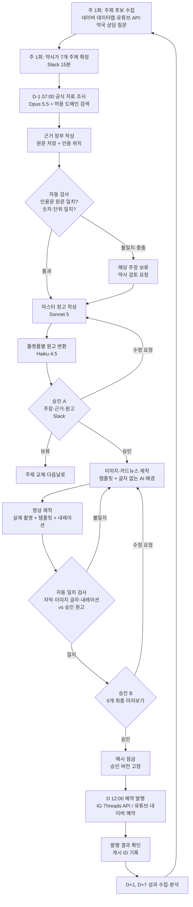
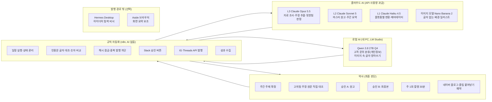
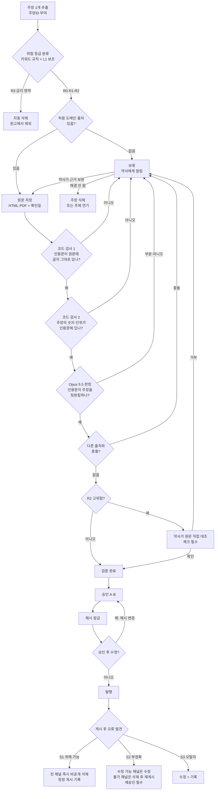
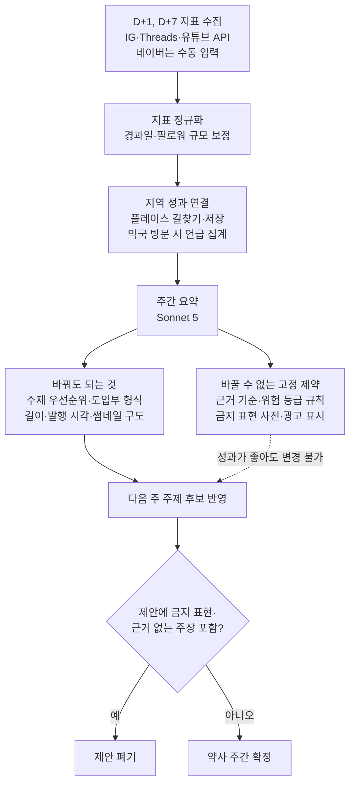

# 약국 AI 콘텐츠 제작·승인·발행 시스템 설계서

- 작성 기준일(가격·정책 조사일): **2026-09-28**
- 대상: 부산 소재 약국 1곳, 비개발자 약사 1인 운영
- 표기 규칙
  - **[확인]** 공식 문서 또는 공식 발표를 이번 조사에서 직접 확인한 사실
  - **[보도]** 공식 페이지에 접속하지 못해 언론·2차 자료로만 확인한 사실 (사용 전 공식 페이지에서 재확인 필요)
  - **[판단]** 설계상 판단 (사실이 아님)
  - **[추정]** 가정에 기반한 계산값
  - **[확인 필요]** 조사로 확정하지 못했거나 법적 해석이 필요한 항목

> 이 문서는 법률 자문이 아닙니다. [확인 필요]로 표시된 법규 항목은 대한약사회, 관할 보건소, 식약처 또는 변호사에게 확인한 뒤 적용하세요.

---

## ① 가장 추천하는 구조

### 한 문장 요약

**"순서가 정해진 워크플로(n8n)가 매일 같은 순서로 일을 돌리고, 비싼 AI는 근거 검증에만 쓰고, 약사님은 하루 두 번 Slack 버튼으로 승인한다. 승인 전에는 비싼 이미지·영상 제작도 발행도 하지 않는다."**

### 핵심 선택 6가지와 이유

| # | 선택 | 이유 |
|---|---|---|
| 1 | **오케스트레이터는 에이전트가 아니라 워크플로 자동화(n8n)** | 의약학 콘텐츠는 "매번 같은 순서, 같은 검사, 같은 잠금"이 필요합니다. 자유도가 높은 에이전트는 순서를 건너뛰거나 스스로 판단을 바꿀 수 있어 감사(나중에 무엇이 왜 일어났는지 확인)가 어렵습니다. 워크플로는 화면에서 상자와 화살표로 보이므로 비개발자도 고칠 수 있습니다. [판단] |
| 2 | **공통 원본 1개 → 6개 콘텐츠로 재가공** | 조사·검증은 하루 1회만 하고, 검증된 "마스터 원고"만 플랫폼별로 바꿉니다. 검증 비용과 오류 가능성이 한 곳에 모입니다. [판단] |
| 3 | **승인 2단계: 원고 승인(A) → 최종 미리보기 승인(B)** | 이미지·영상은 비싸고 고치기 어렵습니다. 주장·원고를 먼저 확정해야 재제작 비용이 줄어듭니다. [판단] |
| 4 | **근거 검증은 "AI 의견"이 아니라 "원문 대조"로 통과시킴** | 출처 원문을 저장하고, 인용문이 저장된 원문에 글자 그대로 있는지를 **프로그램(코드)** 이 확인합니다. AI 두 개가 동의해도 이 검사를 통과하지 못하면 보류합니다. [판단] |
| 5 | **이미지 속 한글은 AI가 그리지 않음** | AI 이미지는 글자 없는 배경·일러스트로만 만들고, 한글·수치는 디자인 템플릿에 승인된 원고를 그대로 넣습니다. 한글 깨짐, 숫자 오류가 구조적으로 줄어듭니다. [판단] |
| 6 | **네이버 블로그·클립은 사람이 올림** | 네이버 블로그 글쓰기 API는 2020년 5월 종료되었고[확인], 네이버 클립의 공개 업로드 API는 이번 조사에서 확인되지 않았습니다[확인 필요]. 비공식 브라우저 자동화는 계정 제재 위험이 있어 기본으로 쓰지 않습니다. 대신 자동화가 "복사해서 붙여넣기만 하면 되는 발행 패키지"를 만들어 둡니다. |

### 지역 약국 성과로 이어지는 구조 (조회수가 아니라 방문)

```
신뢰 형성 (정확한 생활 약학 정보, 약사 실명·실제 약국 모습)
  → 지역 연결 (부산·동네 맥락: 폐의약품 수거, 계절 질환, 약국 운영시간)
  → 행동 유도 (네이버 플레이스 저장·길찾기, "궁금하면 약국에서 물어보세요")
  → 실제 성과 (방문 상담 수, "SNS 보고 왔어요" 집계, 플레이스 길찾기 수)
```

- 성과 지표는 조회수보다 **저장·공유·프로필 방문·네이버 플레이스 길찾기·방문 시 언급 횟수**를 우선합니다. [판단]
- 위층 병원이 막 개원한 상황이라도 **특정 의료기관으로 처방을 유도하는 콘텐츠는 만들지 않습니다.** 약사법상 의사와의 담합 금지 규정과의 관계를 확인해야 합니다. [확인 필요]

### 수익 모델 요약 (자세한 내용은 부록 A)

| 구분 | 모델 | 판단 |
|---|---|---|
| ✅ 권장 | 약국 방문 유도(상담·일반의약품·건강기능식품 매장 판매) | 가장 현실적이고 법적 위험이 가장 낮음 |
| ✅ 가능 | 플랫폼 수익(유튜브 파트너, 네이버 클립 광고 인센티브, 블로그 애드포스트), 강의·기고·기업 교육 | 계정이 성장한 뒤 부수입. 각 플랫폼 자격 조건 확인 필요 |
| ⚠️ 조건부 | 건강기능식품·의약외품·생활용품 공동구매 | 의약품이 아닌 품목만, 통신판매업 신고, 기능성 광고 심의, 광고 표시, "약사 추천" 표현 제한 확인이 모두 필요 [확인 필요] |
| ⚠️ 조건부 | 제약사·브랜드 협찬 콘텐츠 | "광고" 표시 필수. 의약품 협찬은 약사가 효능을 보증하는 것처럼 보이면 안 됨 → 사실상 피하는 것을 권장 |
| ❌ 불가 | 의약품(일반의약품 포함) 온라인 판매·공동구매 | 약사법 제50조: 약국 외 장소 판매 금지, 온라인 판매는 위반 [확인] |
| ❌ 불가 | 전문의약품 광고, 체험담·치료 효과 보증형 광고 | 약사법 제68조, 의약품 등의 안전에 관한 규칙 [별표 7] [확인] |

### 현재 확인되지 않은 가정 (임시로 두고 설계함)

| 가정 | 임시값 | 틀리면 바뀌는 것 |
|---|---|---|
| 월 예산 | 권장 구성 기준 ₩15~25만 | 구성 선택 |
| PC 사양 | 모름. Qwen 3.8 27B Q4를 LM Studio에서 쓰고 있으므로 VRAM 16~24GB급 GPU 또는 통합 메모리 32GB 이상 Mac으로 가정 | 로컬 AI 역할 범위 |
| PC 상시 가동 | 영업 시간에만 켜짐 | n8n 자체 설치 vs 클라우드 |
| 얼굴·목소리 | 얼굴은 선택, 목소리는 본인 녹음 가능 | 영상 제작 방식 |
| 계정 | 인스타그램은 비즈니스 계정 전환 가능, 유튜브 채널 있음, 네이버 블로그 있음 | 발행 자동화 범위 |
| 환율 | $1 = ₩1,400, €1 = ₩1,600 (계산 편의용 가정) | 원화 환산 |

---

## 모델·도구 이름 확인 결과 (요청하신 이름 검증)

"에이전트"는 AI 모델이 아니라 **구조**입니다. 에이전트 = (두뇌 역할 모델) + (쓸 수 있는 도구) + (목표를 향해 반복하는 루프). 같은 에이전트 프로그램이라도 두뇌 모델을 클라우드(예: Claude Opus 5.5)로 쓰면 클라우드 비용이 나오고, 로컬(Qwen 3.8 27B)로 쓰면 PC에서 돕니다. 즉 **"에이전트 = 로컬 AI"가 아닙니다.**

| 요청하신 이름 | 확인 결과 | 정확한 명칭·상태 | 이 설계에서의 위치 |
|---|---|---|---|
| Claude Opus 5.5 | **[확인]** 존재 | `claude-opus-5-5`, API 입력 $4 / 출력 $20 (100만 토큰당), 캐시 읽기 $0.20 | **L3**: 근거 수집·주장 추출·뒷받침 판정 |
| GPT-6 Sol | **[보도]** 존재 (2026-09-22 출시 보도) | 입력 $2 / 출력 $10 (보도 기준) | **L2** 대안: 한국어 원고 작성 |
| GPT-6 Astra | **[보도]** 존재 (2026-09-03 출시 보도) | 입력 $10 / 출력 $50 (2차 자료 기준) | **L4**: 일상 파이프라인 사용 안 함 |
| "RUNA" | **[확인 불가]** OpenAI GPT-6 계열에서 이 이름은 찾지 못함 | 아마 **GPT-6 Luna**의 오기로 추정. Luna는 입력 $0.10 / 출력 $0.50 (보도 기준) | Luna라면 **L1**: 형식 변환 대안 |
| Claude Fable 5.1 | **[확인]** 존재 | 입력 $10 / 출력 $50 | **L4**: 일상 사용 안 함(오버스펙) |
| Qwen 3.8 27B Q4 | **[확인]** 존재 | Qwen3.8-27B, 2026-08 Hugging Face 공개, Apache 2.0, 이미지 입력 가능. Q4 양자화 시 약 17GB 메모리 필요(2차 자료) | **L1 로컬**: 개인정보 포함 분류, 이미지 속 글자 받아쓰기(OCR) |
| Hermes Agent Desktop | **[확인]** 존재. 정식 명칭은 **Hermes Desktop** (Nous Research의 오픈소스 Hermes Agent용 데스크톱 앱, 2026-06 공개 프리뷰 v0.15.2, MIT 라이선스) | 무료. 두뇌 모델은 사용자가 연결(클라우드 또는 로컬) | 발행 경로 **밖**의 개인 비서용(아이디어 탐색). 오케스트레이터로 쓰지 않음 |
| 어사이드 (Aside) | **[확인]** 존재. aside.com, YC 출신 AI 브라우저. 로그인된 사이트에서 작업을 대신 수행 | 가격 미확인 | 발행 경로 **밖**. 사람이 보는 화면 요약 보조 정도만. SNS 자동 게시·스크래핑에는 쓰지 않음 |
| Claude Sonnet 5 | **[확인]** | 입력 $2 / 출력 $10 | **L2 기본**: 한국어 마스터 원고 |
| Claude Haiku 4.5 | **[확인]** | 입력 $1 / 출력 $5 | **L1 클라우드 기본**: 플랫폼별 변환 |

### 역할에 맞는 모델 등급 (오버스펙 방지)

| 등급 | 쓰는 곳 | 기본 모델 | 대안 | 금지 사항 |
|---|---|---|---|---|
| **L0 규칙** (AI 없음) | 일정 실행, 파일 이동, 상태 변경, 인용문 글자 대조, 숫자·단위 비교, 해시 비교, 중복 발행 검사 | n8n 노드, 코드 노드 | Make | AI에게 맡기지 않음 |
| **L1 경량** | 플랫폼별 형식 변환, 해시태그·메타데이터, 위험 키워드 분류 보조, 이미지 속 글자 받아쓰기 | Claude Haiku 4.5 (클라우드) | Qwen 3.8 27B (로컬) / GPT-6 Luna | 새 의학적 주장 생성 금지 |
| **L2 중급** | 마스터 원고 작성, 주간 성과 요약 | Claude Sonnet 5 | GPT-6 Sol | 근거 판정 금지 |
| **L3 고급** | 공식 자료 검색·주장 추출·뒷받침 판정 | Claude Opus 5.5 | (없음, 대신 약사 검토 강화) | 하루 호출 수·토큰 상한 설정 |
| **L4 최상위** | 일상 파이프라인에서 쓰지 않음. 분기 1회 "운영 규칙 전체 점검" 정도 | Claude Fable 5.1 | GPT-6 Astra | 매일 사용 금지 |

---

## ② 다각도 업무 흐름도

### 2-1. 전체 제작·발행 흐름도



**해설**: 하루 전에 만들고 다음 날 발행합니다(D-1 제작). 가장 중요한 점은 **승인 A를 통과하기 전에는 이미지·영상을 만들지 않는다**는 것입니다. 원고가 바뀌면 이미지·영상을 다시 만들어야 하므로, 비싼 작업은 원고가 확정된 뒤에만 합니다. 주제 선정은 매일 하지 않고 일주일에 한 번 몰아서 합니다.

### 2-2. 역할 분담도 (클라우드 AI / 로컬 AI / 자동화 / 약사)



**해설**: 모든 작업의 시작과 끝은 n8n(규칙 자동화)입니다. n8n이 "지금은 Opus에게 조사를 시키고, 끝나면 글자 대조를 하고, 그다음 Slack으로 승인을 요청한다"는 순서를 지킵니다. AI는 n8n이 부를 때만 일합니다. Hermes Desktop과 Aside는 발행 경로에 연결하지 않습니다. 이 둘은 자유도가 높아서 승인 잠금을 우회할 수 있기 때문입니다.

**로컬 AI를 이 위치에 둔 이유**: 월 비용으로 보면 로컬 AI의 절감 효과가 거의 없습니다(⑥ 참고). 대신 **고객 문의처럼 건강 개인정보가 섞인 데이터를 외부로 보내지 않아야 할 때**와, 비용 없이 반복할 수 있는 **이미지 속 글자 받아쓰기**(Qwen 3.8은 이미지 입력 가능)에서 가치가 있습니다.

### 2-3. 근거 검증·승인·반려·오류 복구 흐름도



**해설**: 한 주장이 "검증 완료"가 되려면 네 관문을 모두 통과해야 합니다. (1) 인용문이 저장된 원문에 **글자 그대로** 있는지, (2) 숫자·단위가 인용문에 있는지는 AI가 아니라 **코드**가 확인합니다. AI가 가장 흔하게 틀리는 "없는 인용", "숫자 바꿔치기"를 AI 판단 없이 걸러내기 위해서입니다. (3) 인용문이 주장을 실제로 뒷받침하는지는 Opus가 판정하지만, (4) 고위험(R2)은 약사님이 원문을 직접 확인해야 통과합니다. 승인 후 파일이 한 글자라도 바뀌면 해시(파일 지문)가 달라져 자동으로 재승인 대상이 됩니다.

### 2-4. 성과 분석 → 다음 기획 개선 루프



**해설**: 성과 분석은 "어떤 주제를, 어떤 형식으로, 언제 올릴지"만 바꿀 수 있습니다. "더 자극적으로 말하기", "근거 기준 낮추기"는 성과가 아무리 좋아도 시스템이 받아들이지 않습니다. 금지 표현 사전과 위험 등급 규칙은 약사님만 수정할 수 있는 별도 시트에 둡니다.

---

## ③ 단계별 실행 표

위험 등급 정의 [판단]:
- **R0 생활 정보**: 약 보관, 폐의약품 배출, 약국 이용 방법
- **R1 일반 건강 정보**: 증상 설명, 생활 습관, 성분 일반 설명
- **R2 고위험**: 용량, 상호작용, 금기, 임신·수유, 소아, 고령자, 질환별 치료, 성분 간 비교
- **R3 발행 금지**: 전문의약품 제품명 홍보, 개인 맞춤 복용 지시, 진단, 치료 효과 단정("완치", "100%"), 특정 의약품 추천, 체험담

| # | 단계 | 입력 | 수행 주체 | 도구 | 출력 | 통과 조건 | 실패 대응 (되돌아갈 곳·재시도·비용 상한) |
|---|---|---|---|---|---|---|---|
| 1 | 주제 후보 수집 (주 1회) | 네이버 데이터랩 검색어 추이, 유튜브 인기 영상 지표, 약국 상담 메모(개인정보 제거) | 자동화 + L1 | n8n, 네이버 데이터랩 API, YouTube Data API, Qwen(상담 메모 분류) | 주제 후보 15~20개 + 레퍼런스 기록 | 후보마다 URL·게시일·확인일·지표 기록 | 지표 없으면 "지표 미확인"으로 표시(추정 금지). API 실패 시 1회 재시도 후 수동 |
| 2 | 레퍼런스 분석 | 후보별 인기 게시물 3~5개 | L2 | Sonnet 5 | 질문 유형·도입부 유형·구성 태그 (문장 복사 없음) | 원문 문장 인용 0건 | 원문 문장이 섞이면 재생성 1회 |
| 3 | 주제 확정 (주 1회) | 후보 + 분석 | **약사** | Slack | 요일별 주제 7개 + 위험 등급 | 약사 확정 | R2 주제는 주 2회 이하 권장 [판단] |
| 4 | 공식 자료 조사 | 주제, 허용 도메인 목록 | L3 | Opus 5.5 + 웹 검색(허용 도메인 제한) + 웹 페치 | 출처 후보 목록 + 원문 저장본 | 주장마다 허용 도메인 출처 1개 이상 | 재시도 2회, 하루 검색 20회·$1.5 상한. 초과 시 중단·알림 |
| 5 | 근거 장부 작성 | 원문 저장본 | L3 + 자동화 | Opus 5.5, Google Sheets | 주장별 장부 행 | 모든 필수 칸 채움 | 빈 칸 있으면 해당 주장 보류 |
| 6 | 약학 사실 검증 | 장부 | L0 + L3 + **약사(R2)** | n8n 코드 노드, Opus 5.5 | 주장별 상태 | 2-3 흐름도 관문 모두 통과 | 보류 주장이 핵심 메시지면 주제 연기 |
| 7 | 마스터 원고 | 검증 완료 주장만 | L2 | Sonnet 5 | 마스터 원고(주장ID 태그 포함) | 원고의 모든 의학 문장에 주장ID 있음 | 태그 없는 의학 문장 발견 시 재작성 1회, 그래도 있으면 삭제 |
| 8 | 플랫폼별 변환 | 마스터 원고 | L1 | Haiku 4.5 (대안: Qwen 로컬) | 6개 원고 + 해시태그 + 제목 | 새 주장ID 없음, 금지 표현 0건 | 재생성 2회 후 해당 채널만 수동 작성 |
| 9 | **승인 A** | 주장·근거·위험 표현·6개 원고 | **약사** | Slack 버튼 | 승인/수정/보류 | 약사 승인 | 수정 요청은 하루 최대 2회. 초과 시 다음날로 |
| 10 | 이미지·카드뉴스 | 승인된 원고 | 자동화 + 이미지 모델 | Canva 템플릿, Nano Banana 2 | 카드뉴스 1세트, 블로그 이미지 3~4장, 썸네일 | 한글은 템플릿에만, AI 이미지는 글자 없음 | 이미지당 재생성 3회, 하루 $2 상한. 초과 시 직접 촬영 사진·단색 배경으로 대체 |
| 11 | 영상 | 승인 원고, 촬영본 | **사람(편집)** + 자동화 | Vrew (대안 CapCut) | 9:16 마스터 영상 1개 + 자막 파일 | 60초 이하(3개 플랫폼 공통 사용 목적) | 렌더 2회 재시도 |
| 12 | 일치 검사 | 최종 파일들, 승인 원고 | L0 + L1 | n8n 코드, Qwen(이미지 글자 받아쓰기), Vrew 음성 분석 | 불일치 목록 | 숫자·단위·성분명 불일치 0건 | 불일치 시 10·11로 복귀 |
| 13 | **승인 B** | 6개 미리보기 + 일치 검사 결과 | **약사** | Slack 버튼 | 승인 → 해시 잠금 | 약사 승인 | 수정 시 10·11 복귀, 원고 변경이면 9로 |
| 14 | 예약 발행 | 잠긴 파일 | 자동화 + **사람(네이버)** | IG·Threads API, YouTube Studio 예약, 네이버 에디터 예약 | 게시 ID | 발행 직전 해시 재확인 일치 | 채널별 독립 재시도 2회(30분 간격). 실패 시 수동 업로드 패키지 전송 |
| 15 | 게시 확인 | 게시 ID | 자동화 | n8n | 발행 로그 | 게시물 존재·캡션 일치 | 불일치 시 알림 |
| 16 | 성과 분석 (주 1회) | D+1·D+7 지표 | 자동화 + L2 | n8n, Sonnet 5 | 주간 리포트 | 고정 제약 위반 제안 0건 | 위반 제안은 자동 폐기 |

### 반드시 들어가야 하는 안전장치

| 장치 | 구현 방법 (n8n 기준) | 판단 |
|---|---|---|
| 근거 부족 시 발행 중단 | 장부의 상태가 "검증 완료"가 아닌 주장ID가 원고에 하나라도 있으면 승인 A 요청 자체를 보내지 않음 | [판단] |
| 승인 대기 중 발행 금지 | 발행 워크플로는 발행 시트에서 상태 = `승인B완료`인 행만 읽음. 다른 상태는 무시 | [판단] |
| 승인 버전 = 게시 버전 | 승인 B 시점에 각 파일의 SHA-256 해시(파일 지문)를 기록 → 발행 직전 다시 계산해 다르면 발행 중단 | [판단] |
| 승인 후 수정 시 재승인 | 파일이 바뀌면 해시가 달라지므로 자동으로 `재승인필요` 상태. "의미가 달라졌는지"를 AI에게 묻지 않고 모든 변경을 재승인(버튼 1번) | [판단] |
| 일부 채널 실패 | 채널별로 독립 처리. 성공한 채널은 그대로 두고 실패 채널만 재시도. **콘텐츠끼리 "릴스에서 자세히" 같은 상호 참조를 넣지 않아** 한 채널 실패가 다른 채널을 깨뜨리지 않게 함 | [판단] |
| 중복 발행 방지 | 발행 키 = `날짜-주제-채널-버전`. 발행 전에 로그에 같은 키가 `발행완료`면 건너뜀. 응답 시간 초과 후 재시도 전에는 해당 계정의 최근 게시물을 조회해 같은 캡션이 이미 있는지 확인 | [판단] |
| 비용 상한 | n8n이 하루 API 사용액을 시트에 누적. 권장 구성 기준 하루 $5 초과 시 AI 단계 중단 + Slack 알림. 클라우드 콘솔의 월 사용 한도도 함께 설정 | [판단], 콘솔 한도 기능 [확인 필요] |

### 게시 후 오류 대응 절차

| 등급 | 예시 | 조치 | 기한 [판단] |
|---|---|---|---|
| **S1 위해 가능** | 용량·금기·상호작용 오류 | 전 채널 즉시 비공개 또는 삭제 → 정정 게시 → 오류 기록 → 해당 규칙 보완 | 발견 즉시 |
| **S2 부정확** | 근거보다 과장된 표현 | 수정 가능한 채널(블로그 본문, IG 캡션)은 수정, 영상처럼 교체가 안 되는 채널은 삭제 후 재게시. 수정본도 승인 필수 | 24시간 내 |
| **S3 오탈자** | 의미 변화 없는 맞춤법 | 수정 + 기록 | 다음 운영일 |

- 영상 파일 교체는 대부분 플랫폼에서 불가하므로 **삭제 후 재업로드**를 기본으로 봅니다. Threads 게시물 수정 가능 기간 등 플랫폼별 수정 가능 범위는 [확인 필요].
- 오류 기록 시트: 발견일, 발견 경로, 채널, 주장ID, 오류 내용, 조치, 조치 시각, 재발 방지 규칙.

---

## ④ 모델·도구 추천 표

역할마다 기본 1개 + 대안 1개로 좁혔습니다.

| 역할 | 기본 추천 | 대안 | 추천 이유 | 비용 구조 | 주요 제약 |
|---|---|---|---|---|---|
| 오케스트레이터 | **n8n** (클라우드 Starter) | Make | 승인 대기 노드(Slack "Send and Wait for Response")가 기본 제공[확인], 화면으로 흐름 확인 가능 | Starter €20/월(연간) 또는 €24/월(월간), 월 2,500회 실행[보도]. 자체 설치는 무료지만 PC 상시 가동 필요 | 자체 설치 시 Slack 승인 버튼을 받으려면 외부에서 접속 가능한 주소 필요[확인] |
| 검색·출처 수집 | **Claude API 웹 검색 + 웹 페치** (허용 도메인 제한) | 약사가 의약품안전나라 등에서 직접 검색 | `allowed_domains`로 식약처·질병청 등만 검색하도록 제한 가능[확인] | 검색 1,000회당 $10, 페치는 추가 요금 없음(토큰 비용만)[확인] | 허용 도메인 목록 최대 64개[확인]. 의약품안전나라는 동적 페이지라 원문 저장이 안 될 수 있음 → 약사가 PDF로 저장 [확인 필요] |
| 근거 정리·복잡한 추론 | **Claude Opus 5.5** | (없음) 약사 검토 강화 | 인용 위치 추출·뒷받침 판정 품질 | $4/$20 per 100만 토큰, 캐시 읽기 $0.20, 배치 50% 할인[확인] | 판정은 참고 신호일 뿐, 통과 조건은 코드 검사 + 약사 |
| 한국어 원고 | **Claude Sonnet 5** | GPT-6 Sol | 비용 대비 자연스러운 한국어 | $2/$10[확인] / Sol $2/$10[보도] | 새 주장 추가 금지 규칙 필요 |
| 플랫폼별 변환 | **Claude Haiku 4.5** | Qwen 3.8 27B (로컬, LM Studio) | 하루 사용량이 작아 월 몇 천 원 수준. 로컬은 PC 상태에 따라 불안정 | $1/$5[확인] | 로컬은 PC가 켜져 있어야 함 |
| 이미지 | **Nano Banana 2** (Gemini 3.1 Flash Image) + **Canva 템플릿** | Nano Banana Pro 또는 OpenAI 이미지 모델 | 배경·일러스트는 저가 모델로 충분, 한글은 템플릿 | 이미지당 약 $0.045~$0.151 (해상도별)[보도] | 실제 약 포장·알약·해부도는 AI 생성 금지(C 참고) |
| 영상·음성·자막 | **Vrew** + 본인 목소리 녹음 | CapCut | 한국어 자막·음성 분석에 강함 | Free / Light ₩9,900 / Standard ₩17,900 / Business ₩39,600 (월간)[보도] | 편집은 사람 손이 필요(하루 15~20분). 완전 자동 렌더는 확장 구성에서 |
| 승인·피드백 | **Slack** (무료 플랜) + n8n 승인 노드 | Telegram 봇 | 버튼 승인, 승인자 기록, 스레드로 수정 요청 | 무료 | 무료 플랜 메시지 보관 기간 제한 → 승인 기록은 시트에 별도 저장 [확인 필요] |
| 파일·근거·버전 관리 | **Google Sheets(근거 장부·상태) + Google Drive(원문·파일)** | Airtable | 비개발자에게 익숙, n8n 연결 쉬움 | 무료 용량 내 시작 | 시트 편집 권한을 약사 1인으로 제한 |
| 발행 | **공식 API(IG·Threads) + 공식 예약 기능(유튜브·네이버)** | Buffer (IG·Threads·YouTube Shorts 지원[보도]) | 공식 경로라 계정 안정성 높음 | API 무료, Buffer 채널당 월 $5(Essentials)[보도] | 아래 플랫폼 표 참고 |
| 성과 분석 | **n8n 수집 + Sonnet 5 주간 요약** | Buffer 분석 | 원시 지표는 코드로, 해석만 AI | 월 $1 미만[추정] | IG 인사이트 일부는 팔로워 1,000명 이상 조건 [보도] |

### 에이전트 방식 vs 워크플로 방식 (오케스트레이터 비교)

| 기준 | 자유도 높은 에이전트 (예: Hermes Desktop이 스스로 계획) | 순서 고정 워크플로 (n8n) |
|---|---|---|
| 순서 보장 | 모델이 판단해서 건너뛸 수 있음 | 항상 같은 순서 |
| 승인 잠금 | 프롬프트로만 막음 → 우회 가능성 | 구조로 막음(상태가 아니면 발행 노드에 도달 불가) |
| 비용 예측 | 반복 횟수가 가변적 | 호출 횟수 고정 |
| 문제 추적 | 대화 기록을 읽어야 함 | 실행 기록에서 실패 노드가 빨갛게 표시 |
| 비개발자 수정 | 프롬프트 수정 → 결과 예측 어려움 | 상자 하나 수정 |
| 새로운 상황 대응 | 강함 | 약함(사람이 규칙 추가) |

**판단**: 이 업무는 **워크플로 방식이 더 안정적이고 관리하기 쉽습니다.** 에이전트는 워크플로 안의 **한 칸**(4단계 자료 조사)에서만 씁니다. 이때도 검색 횟수(`max_uses`), 허용 도메인, 출력 형식(JSON)을 고정합니다.

### 플랫폼별 발행 가능 범위

| 콘텐츠 | 공식 API 자동 발행 | 공식 예약 기능 | 외부 도구 | 사람이 직접 |
|---|---|---|---|---|
| IG 릴스 | ✅ Instagram Graph API (비즈니스 계정) [확인: 공식 문서 존재, 세부 조건은 문서에서 재확인] | 앱·Meta Business Suite 예약 [확인 필요] | Buffer | 음원 추가(플랫폼 음원 라이브러리) |
| IG 스토리 | ✅ API에서 `media_type=STORIES` 지원 [보도] | Meta Business Suite [확인 필요] | Buffer(방식 확인 필요) | 링크·설문 등 스티커 [확인 필요] |
| Threads | ✅ Threads API, 24시간당 250개 [보도] | 앱 예약 기능 [확인 필요] | Buffer | — |
| 네이버 블로그 | ❌ 글쓰기 API 2020년 종료 [확인] | ✅ 에디터 예약 발행 [확인 필요] | 비공식 자동화는 권장 안 함 | ✅ 발행 패키지 붙여넣기 + 예약 (5~10분) |
| 네이버 클립 | ❌ 공개 업로드 API 확인 못 함 [확인 필요] | 앱 내 예약 기능 [확인 필요] | — | ✅ 앱 업로드 (3~5분) |
| 유튜브 쇼츠 | ⚠️ `videos.insert` 가능하나 **미검증 프로젝트는 비공개로만 업로드됨 → 감사 통과 필요** [보도, 공식 문서 기재] | ✅ YouTube Studio 예약 공개 | Buffer | 초기에는 Studio 예약 권장 |

- 인스타그램 API 발행 수 제한은 자료마다 50개 또는 100개(24시간)로 다르게 적혀 있습니다[보도]. 하루 2개(릴스 1, 스토리 1)라 어느 쪽이든 문제없습니다.
- 유튜브 API 업로드는 감사 절차 부담이 크므로 **처음 4주는 Studio 예약**을 권장합니다. [판단]

### 릴스·쇼츠·클립 영상 원본 공유 여부

**공유 가능한 것 (공통 마스터)** [판단]
- 9:16 세로, 1080×1920, 60초 이하 마스터 영상 1개
- 약사 촬영본, 템플릿 그래픽, 내레이션, 한글 자막(영상에 입힘)
- **다른 플랫폼 워터마크가 없는 깨끗한 원본**으로 내보내기

**플랫폼마다 달라야 하는 것**

| 항목 | 이유 |
|---|---|
| 캡션·제목·해시태그 | 네이버 클립은 네이버 검색 키워드 중심, 인스타그램은 짧은 캡션, 유튜브는 제목 검색 |
| 커버·썸네일 | 플랫폼별 잘림 위치가 다름 |
| 음악 | 플랫폼 음원 라이브러리 라이선스가 다름 → 마스터에는 사용권이 확실한 음원만 넣거나 무음 + 내레이션 |
| UI 안전 영역 | 좋아요·댓글 버튼이 가리는 위치가 달라서 자막을 화면 중앙~하단 1/3 위쪽에 배치 |
| AI 표시 | 유튜브 "변경되거나 합성된 콘텐츠" 체크, Meta "AI 정보" 라벨 → 실사처럼 보이는 AI 장면이 있을 때만 해당 [보도] |
| 연결 링크 | 네이버 클립·블로그는 네이버 플레이스, 인스타그램은 프로필 링크 |
| 최대 길이 | 플랫폼별 최대 길이는 변경이 잦으므로 업로드 전 확인 [확인 필요]. 60초 이하 마스터면 세 곳 모두 쓸 수 있는 것으로 가정 |

---

## ⑤ 하루 운영 예시

### 주제: "다 쓴 약, 어떻게 버리나요? — 부산 폐의약품 배출법" (위험 등급 R0)

선택 이유: 생활 정보라 위험도가 낮고, 부산 지역성이 있고, 약국 방문(폐의약품 수거)으로 자연스럽게 이어집니다.

> ⚠️ 아래 예시의 출처는 **"후보 출처"** 입니다. 이번 조사 환경에서 부산시 누리집 본문에 직접 접속하지 못해 원문을 확인하지 못했습니다. 따라서 아래 주장들은 실제 운영이라면 **"보류(원문 미확인)"** 상태이며, 원문 확인 전에는 발행하지 않습니다. 이것이 시스템이 작동하는 방식을 보여주는 예시이기도 합니다.

#### D-1 07:00 — 자료 조사 (Opus 5.5, 허용 도메인: busan.go.kr, 각 구청, mfds.go.kr, me.go.kr)

찾은 후보 출처:
- 부산광역시 누리집 공지 「폐의약품 수거함 위치 및 참여약국 등 현황 안내 (폐의약품 적정배출 안내)」 https://www.busan.go.kr/nbnews/1635326 — 게시일: 원문 미확인, 확인일: 2026-09-28(목록 페이지만 확인)
- 부산 영도구 보건소 「폐의약품 처리방법 안내」 https://www.yeongdo.go.kr/health/01622/01643.web?amode=view&idx=311501&gcode=1175 — 원문 미확인

#### D-1 07:20 — 근거 장부 (예시 행)

| 주장ID | 사용할 표현 | 출처 | 근거 원문·위치 | 게시·개정·확인일 | 적용 대상·예외 | 검증 상태 | 약사 검토 |
|---|---|---|---|---|---|---|---|
| 0929-C01 | "남은 약은 일반 쓰레기로 버리지 말고 약국·보건소 등의 수거함에 가져오세요" | 부산시 공지(위) | *원문 저장 후 인용문 기입* | 미확인 / 미확인 / 2026-09-28 | 가정 내 폐의약품 | **보류: 원문 미확인** | R0 → 일괄 확인 |
| 0929-C02 | "알약은 포장을 벗겨 한데 모으고, 물약은 새지 않게 뚜껑을 닫아서" | 부산시 공지 또는 구청 안내 | *원문 저장 후 인용문 기입* | 미확인 | 제형별 예외(주사기 등) 확인 필요 | **보류: 원문 미확인** | R0 → 일괄 확인 |
| 0929-C03 | "가까운 수거 장소는 부산시가 공개한 목록에서 확인할 수 있어요" | 부산시 공지 첨부 목록 | *첨부파일명·게시일* | 미확인 | 목록 갱신 주기 확인 | **보류: 원문 미확인** | R0 |

코드 검사 결과(가상): 3개 주장 모두 "원문 저장본 없음" → 인용문 대조 불가 → **자동 보류**. Slack 알림: "원문 페이지 접속 실패. 부산시 공지 원문을 PDF로 저장해 주세요." → 약사님이 PC에서 페이지를 열어 PDF 저장(2분) → 재검사 → 인용문이 원문에 있으면 "검증 완료".

#### D-1 08:30 — 승인 A (Slack, 약 10분)

```
[승인 A] 9/29(월) 주제: 다 쓴 약, 어떻게 버리나요? (R0)
핵심 메시지: 남은 약은 수거함으로. 제형별로 이렇게 챙겨 오세요.

주장 3개 — 모두 검증 완료 ✅
 C01 "일반 쓰레기로 버리지 말고…" ← 부산시 공지 3번째 문단 [원문 보기]
 C02 "알약은 모아서, 물약은 뚜껑 닫아…" ← 부산시 공지 표 [원문 보기]
 C03 "수거 장소 목록" ← 부산시 공지 첨부파일 [원문 보기]

⚠️ 확인할 표현: "절대" 1건 (C01 주변 문장) → "~하지 마세요"로 바꿀지 확인
📄 마스터 원고 [열기]   📱 6개 원고 [열기]

[✅ 승인]  [✏️ 수정 요청]  [⏸ 보류]
```

#### D-1 09:00~15:00 — 제작 (자동 + 사람 20분)

| 콘텐츠 | 공통 원본에서 가져오는 것 | 플랫폼 맞춤 |
|---|---|---|
| IG 릴스 / 유튜브 쇼츠 / 네이버 클립 (마스터 영상 1개) | 약사님이 실제 약국 수거함 앞에서 찍은 5초 컷 3개(주간 촬영분) + 템플릿 자막 + 본인 내레이션 | 캡션·제목·해시태그, 썸네일 |
| IG 스토리 카드뉴스 5장 | C01~C03 문장 그대로 | 마지막 장: 약국 위치·운영시간 |
| Threads | 핵심 메시지 + C01 | 질문형 마무리 ("집에 남은 약 어떻게 하세요?") |
| 네이버 블로그 | 마스터 원고 전체 + 출처 링크 | 실제 촬영 사진 2장 + 제형 설명 일러스트 2장(AI 배경, 글자는 템플릿). AI 이미지에는 "AI 생성 이미지" 표시 |

시각 검증 포인트: 이 주제에는 알약·약 포장이 나옵니다 → **AI로 알약·포장을 그리지 않고** 실제 촬영(상표·환자 정보 가림)만 사용합니다.

#### D-1 저녁 또는 D 08:30 — 승인 B (약 5분)

- 자동 일치 검사 결과: "자막 42개 문장 중 원고와 불일치 0건 / 카드뉴스 글자 받아쓰기 불일치 0건 / 숫자·단위 없음"
- 6개 미리보기 확인 → [✅ 승인] → 해시 잠금

#### D 12:00 — 발행

- IG 릴스·스토리, Threads: n8n이 API로 발행 → 게시 ID 기록
- 유튜브 쇼츠: 전날 Studio에 예약 공개로 올려둠
- 네이버 블로그·클립: 약사님(또는 직원)이 발행 패키지를 붙여넣고 예약 (10분)

**이날 약사님이 한 일**: PDF 저장 2분 + 승인 A 10분 + 승인 B 5분 + 네이버 업로드 10분 = **약 27분** (영상 편집을 직원에게 맡긴 경우)

---

## ⑥ 비용과 내 노동시간 비교

### 사용량 가정 [추정]

- 하루 1주제, 주장 5~10개, 공식 문서 4~8개 읽음
- Opus 5.5: 입력 3만~10만 토큰, 출력 0.5만~1만 토큰/일 (뒷받침 판정 포함)
- Sonnet 5: 입력 2만, 출력 0.5만~1만/일 (수정 1~2회 포함)
- Haiku 4.5: 입력 3만, 출력 0.9만/일 (6개 변환)
- 웹 검색 5~20회/일
- 한국어는 영어보다 토큰이 더 많이 나올 수 있어 여유를 둠. Claude 4.7 이후 모델은 같은 글에서 이전 모델보다 토큰이 약 30% 더 나옴[확인]
- 환율 $1 = ₩1,400 (가정)

### 3가지 구성 비교 (월 30일)

| 항목 | ① 최소 비용 | ② 권장 (균형) | ③ 확장 (품질·자동화) |
|---|---|---|---|
| 개념 | n8n을 내 PC에 설치, 이미지는 직접 촬영 위주, 발행은 대부분 공식 앱 예약 | n8n 클라우드, 이미지 AI 적정 사용, IG·Threads API 발행 | 영상 템플릿 자동 렌더, 고품질 이미지, 모델 이견 탐지 추가 |
| 초기 구축비 | ₩0 + 내 시간 20~30시간 | ₩0~30만(마이크·조명 선택) + 30~40시간 | 외주 구축 선택 시 ₩100~300만 [추정, 시장가 미확인] + 장비 ₩30~80만 [추정] |
| 하드웨어 | 기존 PC·스마트폰 | 기존 PC·스마트폰 | 기존 + 촬영 장비 |
| 월 고정 구독 | Vrew Free~Light ₩0~9,900 | n8n Starter ≈ ₩3.2~3.8만 + Vrew Standard ₩17,900 + Canva Pro [가격 확인 필요] | n8n 상위 플랜 + 영상 렌더 API + 고급 음성 [모두 가격 확인 필요] |
| 텍스트 AI API | $15~35 (₩2~5만) — R2 주제 줄이고 Opus 사용 최소화 | $25~60 (₩3.5~8.4만) | $60~150 (₩8~21만) — GPT-6 Sol 이견 탐지, 분기 1회 Fable 5.1 점검 |
| 검색·자료 수집 | $1.5~3 (₩2~4천) | $3~6 (₩4~8천) | $6~10 (₩8천~1.4만) |
| 이미지 생성 | $0~2 (월 30장 이하) | $7~21 (월 150~300장, Nano Banana 2) | $27~54 (Nano Banana Pro 200~400장) |
| 영상·음성 생성 | Vrew 무료 크레딧 + 본인 목소리 | Vrew Standard에 포함 | AI 영상 클립: 월 상한 ₩10~30만으로 제한 [가격 미확인] |
| 자동화·저장·발행 | ₩0 (단, PC 상시 가동 전기료 ₩1~3만 [추정]) | ₩0~2.1만 (Buffer 선택 시 3채널 × $5) | Buffer Team 등 선택 |
| 재생성·재시도 | 위 AI 비용의 +20~30% | +30~50% | +30~50% |
| **월 합계** | **약 ₩3~10만** | **약 ₩12~25만** | **약 ₩40~80만** (미확인 항목 상한 전제) |
| 하루 검토 시간 | 30~45분 + 수동 발행 20~30분 ≈ **1시간** | 승인 15분 + 네이버 10~15분 ≈ **30분** (+영상 편집 15~20분, 직원 위임 가능) | **15~20분** |
| 주간 유지보수 | 1~2시간 (PC·n8n 업데이트 포함) | 1~2시간 | 2~4시간 (도구가 많아서) |

- **웹 구독과 API는 별개입니다.** Claude Pro($20/월)나 ChatGPT Plus($20/월)[보도]는 약사님이 대화창에서 직접 쓰는 요금입니다. n8n이 부르는 API 비용은 **포함되지 않으며** 별도로 청구됩니다. 권장 구성에서 웹 구독은 선택 사항입니다(주간 주제 구상 등에 유용).

### 로컬 AI vs 소형 클라우드 API (하드웨어 구입비 제외)

같은 업무(하루 6개 플랫폼 변환, 입력 약 3만·출력 약 0.9만 토큰) 기준 [추정]:

| 항목 | Claude Haiku 4.5 | GPT-6 Luna | Qwen 3.8 27B Q4 (로컬) |
|---|---|---|---|
| 토큰 비용 | 약 $0.075/일 → **월 약 ₩3,200** | 약 $0.008/일 → **월 약 ₩300** [보도 가격 기준] | ₩0 |
| 전기료 | ₩0 | ₩0 | 추론 중 전력 약 0.35kW × 하루 0.1~0.25시간 → 월 ₩150~700 [추정]. **예약 실행을 위해 PC를 24시간 켜두면** 대기 전력만 월 ₩9,000~27,000 [추정] |
| 처리 속도 | 수십 초 | 수십 초 | GPU에 따라 수 분. 기본 설정에서 생각이 길어지는 경향이 보고됨[보도] |
| 유지보수 | 거의 없음 | 거의 없음 | 월 1~3시간 (모델·LM Studio 업데이트, 메모리 부족 오류) |
| 장애 | 공급사 장애 시 대안 모델로 전환 | 〃 | PC 꺼짐·절전 모드 = 파이프라인 정지 |

**결론 [판단]**: 이 규모에서는 **로컬 AI가 비용을 줄여주지 않습니다.** 변환 업무는 Haiku 4.5를 기본으로 하고, Qwen은 (1) 고객 문의처럼 **외부로 보내면 안 되는 데이터 처리**, (2) 무제한 반복하는 **이미지 속 글자 받아쓰기**, (3) 클라우드 장애 시 **예비**로 씁니다.

**로컬 실행 조건 (PC 사양을 모르므로 조건부)** [추정]:
- Q4 가중치만 약 17GB[보도]. 문맥 길이만큼 추가 메모리 필요
- **VRAM 24GB 이상 GPU**: 편하게 실행
- **VRAM 16GB GPU**: 일부를 CPU로 넘겨 실행 가능하나 느림
- **Apple Silicon 통합 메모리 32GB 이상**: 실행 가능
- 시스템 RAM 32GB 이상 권장
- 지금 LM Studio에서 잘 돌아가고 있다면 위 조건 중 하나를 충족하는 것입니다.

### 비용 절감 방법

| 방법 | 적용 위치 | 효과 |
|---|---|---|
| 프롬프트 캐싱 | 매일 같은 시스템 지침·금지 표현 사전·장부 형식을 캐시 | Opus 5.5 캐시 읽기는 기본 입력가의 5%[확인] |
| 배치 처리 | 급하지 않은 주간 성과 요약·주제 후보 분석 | 50% 할인[확인] |
| 공통 원본 재사용 | 조사·검증은 하루 1회, 6개 채널은 변환만 | Opus 호출이 채널 수에 비례해 늘지 않음 |
| 모델 등급 배분 | L3는 근거에만, 변환은 L1 | 오버스펙 방지 |
| 수정 횟수 제한 | 승인 A 수정 최대 2회/일, 이미지 재생성 3회/장 | 끝없는 재생성 방지 |
| 원문 페치 길이 제한 | 웹 페치의 `max_content_tokens` 설정[확인] | 긴 PDF 전체를 읽는 비용 방지 |
| 고비용 제작 전 확정 | 승인 A 전 이미지·영상 제작 금지 | 재제작 비용 제거 |

---

## ⑦ 4주 구축 계획

처음부터 전부 자동화하지 않습니다. 매주 "사람이 하던 일을 하나씩 기계에 넘기고, 넘긴 것이 제대로 되는지 확인"합니다.

| 주차 | 할 일 | 완성 결과물 | 다음 단계로 넘어가는 기준 |
|---|---|---|---|
| **1주차: 손으로 돌려보기** | ① Google Sheets에 근거 장부·금지 표현 사전·위험 등급 규칙 시트 만들기 ② 허용 도메인 목록 확정 ③ Claude 웹(구독) 또는 API 콘솔에서 조사·원고 프롬프트 다듬기 ④ R0 주제 3개를 손으로 끝까지 제작 ⑤ Threads·네이버 블로그 2채널만 발행 | 장부 템플릿, 프롬프트 3종(조사·원고·변환), 발행물 3세트 | 3개 주제 모두 장부 빈칸 0, 근거 없는 주장 0, 주제당 소요 시간 측정 완료 |
| **2주차: 조사·승인 자동화** | ① n8n 클라우드 가입 ② Claude API 키 발급, 월 사용 한도 설정 ③ Slack 워크스페이스·앱 만들기 ④ "조사 → 장부 → 코드 검사 → 원고 → 변환 → 승인 A" 워크플로 구축 ⑤ 인스타그램 스토리 카드뉴스(Canva 템플릿) 추가 | 승인 A가 매일 아침 Slack으로 도착 | 5일 연속 승인 A 정상 도착. **일부러 가짜 인용문을 넣었을 때 코드 검사가 보류시키는지 시험 통과** |
| **3주차: 영상·발행 연결** | ① 주 1회 30분 촬영(수거함, 약장, 상담 공간 — 환자·처방전·화면 제외) ② Vrew 템플릿으로 9:16 마스터 영상 제작 ③ 인스타그램 비즈니스 계정 전환, Meta 앱 연결, IG·Threads API 발행 ④ 승인 B + 해시 잠금 + 발행 로그 ⑤ 유튜브는 Studio 예약, 네이버는 발행 패키지 | 6개 콘텐츠 전체 운영 | 7일 연속 6개 발행. **승인 후 파일을 고쳤을 때 발행이 막히는지, 같은 발행을 두 번 눌렀을 때 한 번만 올라가는지 시험 통과** |
| **4주차: 성과·복구 점검** | ① D+1·D+7 지표 자동 수집 ② 네이버 플레이스 지표 주 1회 수동 입력 ③ 약국 방문 시 "SNS 보고 왔어요" 집계(개인정보 없이 숫자만) ④ S1 오류 복구 모의 훈련 ⑤ 비용 상한 초과 시험 | 주간 리포트 1회, 오류 기록 시트, 비용 대시보드 | 5일 연속 약사 검토 30분 이내, 월 예상 비용이 예산 안, 모의 훈련에서 전 채널 30분 내 비공개 처리 |

**4주 후 확장 판단 기준** [판단]: 위 기준을 모두 통과하면 (1) 유튜브 API 감사 신청, (2) 영상 자동 렌더, (3) R2 주제 비중 확대 중 **하나씩** 추가합니다.

---

## ⑧ 내가 먼저 결정할 항목 (5개)

1. **월 예산 상한**: 최소(₩3~10만) / 권장(₩12~25만) / 확장(₩40~80만) 중 어디까지 쓸 수 있나요?
2. **PC 사양과 상시 가동 여부**: GPU 모델(VRAM), RAM, OS, 그리고 PC를 밤에도 켜둘 수 있는지. (n8n 자체 설치 여부와 로컬 AI 역할이 여기서 정해집니다.)
3. **얼굴·목소리 공개**: 본인 얼굴 노출 / 목소리만 / 둘 다 비공개(AI 음성) 중 무엇인가요? (신뢰 형성에는 본인 목소리를 권장합니다.)
4. **기존 계정·도구 상태**: 인스타그램 비즈니스 전환 여부, 네이버 블로그·클립 크리에이터 등록, 유튜브 채널, 사용 중인 Google·Slack 계정, 약국 네이버 플레이스 등록 여부
5. **위임 가능 인력과 수익 방향**: 네이버 수동 업로드·영상 편집을 맡길 직원이 있나요? 건강기능식품 등 제품 판매(공동구매 포함)를 할 계획이 있나요? (있다면 부록 A의 확인 항목을 먼저 처리해야 합니다.)

---

## 지금부터의 실행 순서 (무엇부터 설정하고 연결할지)

1. Google 계정에 폴더 만들기: `근거원문/`, `제작물/`, `발행패키지/` + 시트 4개(`근거장부`, `금지표현사전`, `발행로그`, `오류기록`) — 부록 C 템플릿 사용
2. 허용 도메인 목록 작성 (부록 C)
3. 인스타그램을 비즈니스 계정으로 전환, 네이버 플레이스 정보 정리
4. 1주차: 손으로 3개 주제 제작 (Claude 웹 사용 가능)
5. Anthropic Console에서 API 키 발급 + 월 사용 한도 설정
6. Slack 워크스페이스 생성 → Slack 앱 생성(Interactivity 켜기)
7. n8n 클라우드 가입 → Google Sheets·Slack·Anthropic 자격 증명 연결
8. 워크플로 1: 조사 → 장부 → 코드 검사 → 원고 → 변환 → 승인 A
9. Canva 카드뉴스·블로그 템플릿, Vrew 영상 템플릿 만들기
10. 워크플로 2: 승인 B → 해시 잠금 → IG·Threads 발행 → 발행 로그
11. 워크플로 3: 성과 수집 → 주간 리포트
12. 모의 훈련(가짜 인용문, 승인 후 수정, 중복 발행, S1 오류) 통과 후 매일 운영 시작

---

## 부록 A. 수익 모델과 법규 구분

| 모델 | 관련 규정 | 상태 | 현실화 방법 |
|---|---|---|---|
| 약국 방문 유도 | 약사법(광고·호객 관련 규정), 표시광고법 | ✅ 가능 [판단] — 약국 이용 정보·운영시간 안내는 일반적 | 콘텐츠 마지막에 "궁금한 점은 약국에서 상담하세요" + 플레이스 링크. 할인 미끼 광고, 특정 의약품 가격 광고는 피함 |
| 플랫폼 광고 수익 | 각 플랫폼 파트너 조건 | ✅ 가능 | 유튜브 파트너 프로그램, 네이버 클립 광고 인센티브[보도], 애드포스트. 자격 조건은 각 플랫폼 공식 페이지 확인 |
| 강의·기고·기업 교육 | — | ✅ 가능 | 계정이 신뢰 지표 역할. 가장 법적 부담이 적은 부수입 [판단] |
| 의약품 온라인 판매·공동구매 | **약사법 제50조**: 약국 외 장소 판매 금지, 위반 시 5년 이하 징역 또는 5,000만원 이하 벌금 [확인] | ❌ 불가 | — |
| 온라인 예약 후 약국 수령 (의약품) | 약사법 제50조 해석 | [확인 필요] — 판매 장소·결제 시점 해석 문제 | 법률 자문 전에는 하지 않음 |
| 건강기능식품 공동구매 | 건강기능식품법(판매업 신고), 식품표시광고법(기능성 광고 자율심의, 질병 예방·치료 표현 금지), 전자상거래법(통신판매업 신고), 추천·보증 심사지침(광고 표시) | ⚠️ 조건부 [확인 필요] | 식약처가 SNS 공동구매 부당광고를 집중 단속 중[보도]. **"약사가 기능성을 보증·추천"하는 형태의 광고는 식품표시광고법 시행령 [별표 1]의 부당 표시·광고 유형과 관련될 수 있어** 반드시 확인 [확인 필요]. 가능하다면: 심의 받은 문구만 사용 + "광고" 표시 + 질병 치료 표현 0 |
| 의약외품·화장품·생활용품 공동구매 | 약사법(의약외품 광고), 화장품법(광고), 전자상거래법 | ⚠️ 조건부 [확인 필요] | 품목별 광고 규정 확인 |
| 브랜드 협찬 콘텐츠 | 추천·보증 등에 관한 표시·광고 심사지침(경제적 이해관계 표시) [확인: 지침 존재·개정 추진] | ⚠️ 조건부 | 게시물 첫 부분에 "광고" 또는 "협찬" 명확히 표시. **의약품 협찬은** 약사 보증으로 오해될 수 있어([별표 7]) 받지 않는 것을 권장 [판단] |
| 전문의약품 언급 광고 | 약사법 제68조 제6항 [확인] | ❌ 불가 | 성분 일반 정보도 제품명·구매 유도와 결합하지 않음 |
| 체험담·효능 보증형 콘텐츠 | 약사법 제68조, [별표 7] [확인] | ❌ 불가 | 고객 후기를 콘텐츠에 쓰지 않음 |

**현실적 순서 [판단]**: 1~6개월 방문 유도 → 6~12개월 플랫폼 수익·강의 → 이후 법률 확인을 마친 비의약품 공동구매 검토.

## 부록 B. 규정·제작 품질 체크리스트

### 규정 구분

| 구분 | 핵심 | 근거 상태 |
|---|---|---|
| 의약학 정보 제공 | 특정 제품 구매 유도 없이 일반 정보를 제공. 진단·개인 맞춤 복용 지시 금지 | [판단] |
| 약국 홍보 | 약국 이용 정보는 가능. 담합으로 비칠 수 있는 병원 연계 홍보 금지 | [확인 필요] |
| 의약품 광고 | 거짓·과장 금지, 전문의약품 광고 금지(제68조), 의사·약사 보증 오해 기사 금지, 암시적 방법 금지([별표 7]) | [확인] |
| 협찬·광고 표시 | 경제적 이해관계를 소비자가 알기 쉽게, 게시물과 같은 언어로 표시 | [확인] |
| AI 생성물 표시 | 인공지능기본법(2026-01-22 시행)의 표시 의무는 주로 AI 제품·서비스 **제공 사업자** 대상이며 단순 이용자는 대상이 아니라는 해석이 많음[보도]. 그래도 플랫폼 정책(Meta AI 정보, 유튜브 합성 콘텐츠 공개)과 신뢰를 위해 표시 | [확인 필요] |
| 개인정보 | 촬영 시 환자 얼굴, 처방전, 약봉투 이름, 모니터 화면 노출 금지. 고객 문의 원문을 클라우드 AI에 보내지 않음(로컬 처리 또는 익명화) | [판단] |
| 저작권 | 레퍼런스 문구·이미지·구성 복제 금지, 폰트 상업 이용 허용 확인, 공공기관 이미지는 공공누리 유형 확인, 음원 라이선스 | [판단] |

### 시각 자료 검증 기준

| 소재 | 규칙 |
|---|---|
| 실제 약 포장·알약 모양·식별 표시 | **AI 생성 금지**. 실제 촬영만 사용, 상표는 필요 시 가림 |
| 해부학 그림 | AI 생성 금지. 공공기관 자료(라이선스 확인) 또는 단순 도형으로 대체 |
| 실존 인물 | AI 생성 금지 |
| 약국 내부처럼 보이는 AI 이미지 | 금지 (실제 촬영과 혼동) |
| 허용되는 AI 이미지 | 추상 배경, 단순 일러스트, 아이콘. 이미지 하단에 "AI 생성 이미지" 표시 |
| 이미지 속 글자 | 템플릿에만. AI 이미지 결과물에 글자가 섞여 있으면 폐기 |

### 문구·자막·내레이션 일치 검사 (승인 B 전 자동)

1. 승인 원고에서 숫자·단위·성분명·주장ID 문장을 추출 (코드)
2. 카드뉴스·블로그 이미지 → Qwen 3.8(로컬)로 글자 받아쓰기 → 코드로 원고와 비교
3. 영상 자막 파일(SRT) → 코드로 원고와 비교
4. 최종 영상 음성 → Vrew 음성 분석으로 받아쓰기 → 코드로 원고와 비교
5. 불일치 1건 이상이면 승인 B 요청을 보내지 않고 제작 단계로 돌려보냄

## 부록 C. 템플릿

### 근거 장부 열 구성 (`templates/evidence-ledger.csv`)

| 열 | 설명 |
|---|---|
| 주장ID | `YYMMDD-C01` |
| 주제ID | 날짜-주제 |
| 콘텐츠 표현 | 실제 게시물에 들어갈 문장 |
| 위험등급 | R0~R3 |
| 출처 문서명 | |
| 출처 URL | |
| 출처 기관 유형 | 식약처/질병청/공공기관/허가사항/진료지침/체계적 문헌고찰 |
| 근거 원문 | 저장본에서 그대로 복사한 문장 |
| 원문 위치 | 문단·표·페이지 |
| 원문 저장 파일 | Drive 경로 |
| 발표일 / 개정일 / 확인일 | 3개 열 |
| 적용 대상 | |
| 예외·주의 | |
| 인용 일치(코드) | 일치/불일치 |
| 숫자·단위 일치(코드) | 일치/불일치/해당 없음 |
| 뒷받침 판정(모델) | 지지/부분/불충분 + 모델명 |
| 출처 충돌 | 없음/있음(내용) |
| 검증 상태 | 초안/출처확인/검증완료/보류/폐기 |
| 약사 검토 필요 | 예/아니오 |
| 약사 확인 | 확인일·메모 |
| 사용 채널 | |
| 승인 버전 해시 | |
| 재확인 예정일 | R2는 6개월 [판단] |

### 허용 도메인 초안 (검색 도구 `allowed_domains`)

`mfds.go.kr`(식약처, 의약품안전나라 하위 도메인 포함), `kdca.go.kr`(질병관리청, 국가건강정보포털 하위 도메인 포함), `mohw.go.kr`, `me.go.kr`, `busan.go.kr`, 부산 각 구청 도메인, `law.go.kr`, `hira.or.kr`, `nhis.or.kr`, `who.int`, `cochranelibrary.com`, `pubmed.ncbi.nlm.nih.gov`, `ncbi.nlm.nih.gov`

- 국가건강정보포털·의약품안전나라의 정확한 하위 도메인은 운영 전 확인 [확인 필요]
- 하위 도메인은 상위 도메인 등록으로 포함됨[확인]

### SNS 레퍼런스 기록 규칙

- 이번 설계에서는 **실제 게시물 조사를 하지 않았습니다.** (조사 환경에서 인스타그램·네이버 로그인 콘텐츠에 접근할 수 없었고, 확인하지 않은 조회수를 적지 않기 위해서입니다.)
- 운영 시 기록 열: URL, 플랫폼, 계정 규모(팔로워·구독자), 게시일, 확인일, 확인 가능한 지표(조회·좋아요·댓글·저장), 경과일, **상대 성과 = 하루 평균 조회 ÷ 해당 계정의 평소 조회 중앙값**, 질문 유형, 도입부 유형, 구성 태그
- 공식 경로로 지표 수집: YouTube Data API(`videos.list`의 조회수·게시일), 인스타그램 Business Discovery(다른 비즈니스 계정의 공개 지표) [확인 필요], 네이버 데이터랩(검색어 추이)
- 문장·이미지·구성은 복사하지 않고 **"어떤 질문에 답했는가, 어떤 순서로 설명했는가"만 태그로** 저장

---

## 출처 (조사일 2026-09-28)

모델·가격
- Anthropic 공식 가격표: https://platform.claude.com/docs/en/about-claude/pricing
- Claude 웹 검색 도구(허용 도메인): https://platform.claude.com/docs/en/agents-and-tools/tool-use/web-search-tool
- Claude 구독 요금: https://claude.com/pricing
- GPT-6 Sol·Luna 출시·가격 보도: https://venturebeat.com/technology/openai-releases-gpt-6-sol-and-luna-models-slashing-api-costs-50-or-more , https://qz.com/openai-gpt-6-sol-luna-api-price-cut-092326
- GPT-6 출시일: https://en.wikipedia.org/wiki/GPT-6
- GPT-6 Astra 가격(2차 자료): https://www.aipricing.guru/openai-pricing/
- OpenAI 공식 가격표(조사 환경에서 접속 불가, 사용 전 확인): https://developers.openai.com/api/docs/pricing
- Qwen3.8-27B: https://huggingface.co/Qwen/Qwen3.8-27B , https://simonw.substack.com/p/qwen-38-27b-is-excellent-but-it-defaults
- Hermes Desktop: https://hermes-agent.nousresearch.com/desktop , https://www.marktechpost.com/2026/06/03/nous-research-releases-hermes-desktop-a-native-cross-platform-front-end-for-hermes-agent-v0-15-2-with-streaming-tool-output/
- Aside: https://aside.com/
- 이미지 모델 가격(2차 자료): https://intuitionlabs.ai/articles/ai-image-generation-pricing-google-openai

도구
- n8n Slack 승인 노드: https://docs.n8n.io/integrations/builtin/app-nodes/n8n-nodes-base.slack/approvals
- n8n 가격(2차 자료): https://www.cloudzero.com/blog/n8n-pricing/
- Make 가격: https://help.make.com/adjustments-to-plans-and-pricing
- Vrew 가격: https://vrew.ai/ko/payment/pricepolicy
- Buffer 가격: https://buffer.com/pricing

플랫폼
- Instagram 콘텐츠 발행(조사 환경에서 접속 불가, 사용 전 확인): https://developers.facebook.com/docs/instagram-platform/content-publishing/
- Threads API: https://developers.facebook.com/documentation/threads/overview
- YouTube videos.insert: https://developers.google.com/youtube/v3/docs/videos/insert
- 네이버 블로그 글쓰기 API 종료: https://www.newspim.com/news/view/20200413000737
- Meta AI 콘텐츠 라벨: https://transparency.meta.com/governance/tracking-impact/labeling-ai-content/
- YouTube 합성 콘텐츠 공개: https://blog.youtube/news-and-events/disclosing-ai-generated-content/

법규
- 약사법 제50조: https://law.go.kr/%EB%B2%95%EB%A0%B9/%EC%95%BD%EC%82%AC%EB%B2%95/%EC%A0%9C50%EC%A1%B0
- 약사법 제68조: https://www.law.go.kr/LSW//lsSideInfoP.do?lsiSeq=260567&joNo=0068&joBrNo=00&docCls=jo&urlMode=lsScJoRltInfoR
- 의약품 등의 안전에 관한 규칙 [별표 7]: https://www.law.go.kr/flDownload.do?flSeq=107478629&bylClsCd=110201
- 추천·보증 등에 관한 표시·광고 심사지침: https://www.law.go.kr/admRulInfoP.do?admRulSeq=2100000190311
- 광고 표시 방법(찾기쉬운 생활법령): https://easylaw.go.kr/CSP/CnpClsMain.laf?popMenu=ov&csmSeq=1575&ccfNo=2&cciNo=3&cnpClsNo=1
- 식품 등의 표시·광고에 관한 법률 시행령: https://www.law.go.kr/%EB%B2%95%EB%A0%B9/%EC%8B%9D%ED%92%88%EB%93%B1%EC%9D%98%ED%91%9C%EC%8B%9C%E3%86%8D%EA%B4%91%EA%B3%A0%EC%97%90%EA%B4%80%ED%95%9C%EB%B2%95%EB%A5%A0%20%EC%8B%9C%ED%96%89%EB%A0%B9
- 식약처 SNS 부당광고 단속 보도: https://www.daeryunlaw.com/trend/11624
- 인공지능기본법 시행 보도: https://www.kmib.co.kr/article/view.asp?arcid=1768984300 , https://bh-law.kr/ko/news/column/ai-content-labeling-obligation-guide

예시 주제 후보 출처(본문 미확인)
- 부산시 폐의약품 수거 안내: https://www.busan.go.kr/nbnews/1635326
- 영도구 보건소 폐의약품 처리방법: https://www.yeongdo.go.kr/health/01622/01643.web?amode=view&idx=311501&gcode=1175
