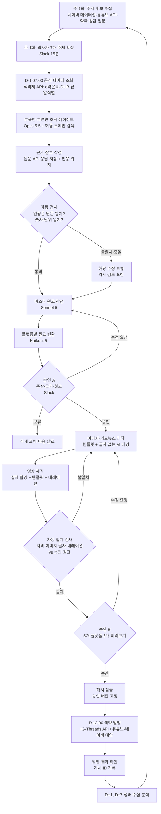
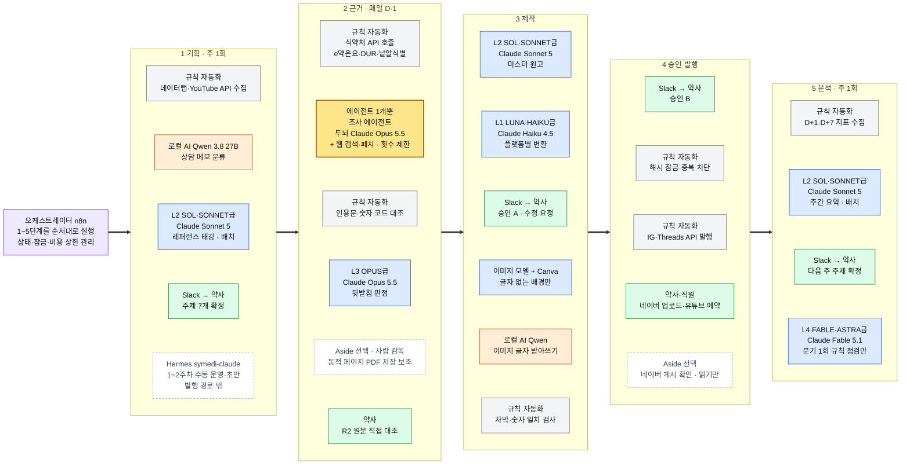
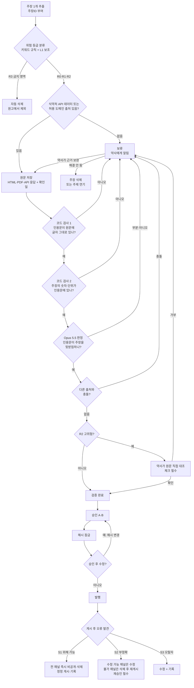
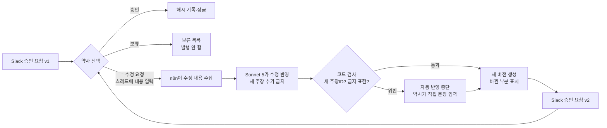
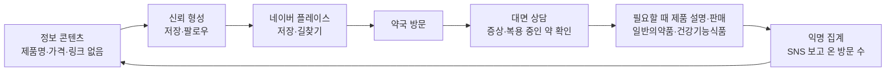
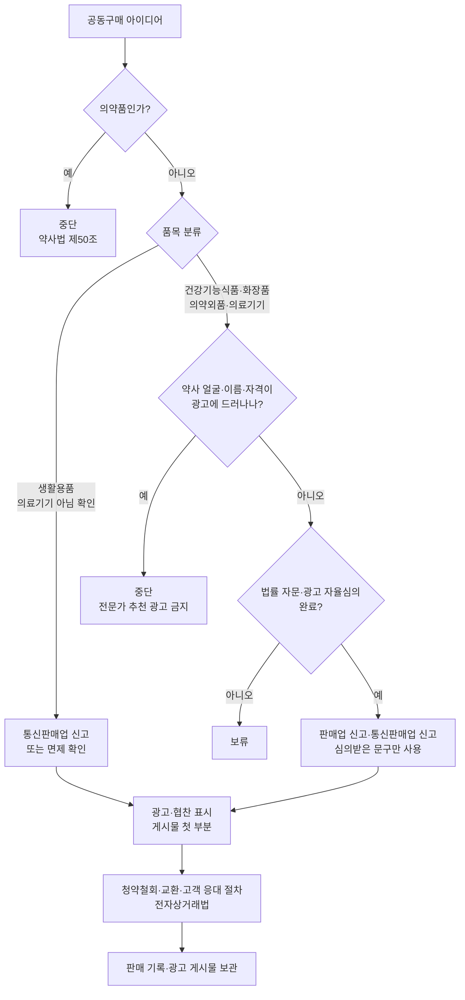

# 약국 AI 콘텐츠 제작·승인·발행 시스템 설계서 (v2.2)

- 작성 기준일(가격·정책 조사일): **2026-09-28**
- 대상: 부산 소재 약국 1곳, 비개발자 약사 1인 운영
- 채널 범위: **플랫폼 5개(인스타그램·Threads·네이버 블로그·네이버 클립·유튜브), 콘텐츠 6개**(인스타그램이 릴스·스토리 2개)

### v2.2에서 바뀐 점 (추가 답변 반영)

1. **PC를 밤에도 켜 둡니다.**
   - 헤르메스 예약 작업을 새벽 시간대로 옮겼습니다.
   - 24시간 가동 전기료를 예산표에 넣었습니다(⑥).
   - n8n은 처음 3개월 동안 클라우드로 유지합니다. PC 자체 설치는 그 뒤의 선택지로 둡니다.
2. **`symedi-claude`는 헤르메스 안의 프로필 이름입니다.** 저장소의 배포본이 이 이름으로 설치됩니다.
3. **공동구매 품목은 건강기능식품 위주입니다.** 그래서 부록 A-7을 건강기능식품 트랙으로 구체화했습니다.
   - 지금 가능한 갈래: 약국 매장 대면 판매
   - 서면 답변 뒤의 갈래: 온라인 공동구매 (체크리스트 포함)

### v2.1에서 바뀐 점 (약사 답변 반영)

1. **확정된 조건을 반영했습니다(① 확정 조건표).**
   - 월 예산 ₩30만 이하
   - PC: RTX 3090 24GB, RAM 32GB
   - 목소리 공개 가능, 얼굴 공개는 미정
   - 전 채널 신규 계정
   - 공동구매 의향 있음
2. **예산 ₩30만 안에서의 배분표를 추가했습니다(⑥).**
3. **공동구매 준비 트랙을 추가했습니다(부록 A-7).** 법률 확인 전에 할 수 있는 일, 전문가에게 물어볼 질문, 단계별 진행 조건을 정리했습니다.
4. **헤르메스 `symedi-claude` 프로필을 만들었습니다(`hermes/`).**
   - 1~2주차 수동 운영을 이 프로필로 합니다.
   - 설치 안내는 `hermes/README.md`에 있습니다.
5. **신규 계정 준비 순서를 추가했습니다(⑦).**

### v2에서 바뀐 점

1. **수익 모델을 크게 보강했습니다(부록 A).** 약사 계정으로 하는 공동구매는 건강기능식품·화장품·의약외품 세 법령의 "전문가 추천 광고 금지"에 동시에 걸립니다. 그래서 등급을 "조건부"에서 **"고위험"**으로 올렸고, 대신 현실적으로 가능한 구조를 제시했습니다.
2. **7개 구성요소 배치 지도를 추가했습니다(②-2).** AI 모델, 클라우드·로컬 AI, 에이전트, 오케스트레이터, 브라우저 하네스(Aside), 모바일 승인(Slack), 규칙 자동화를 단계별로 배치했습니다. 모델 등급 이름(LUNA·HAIKU급 등)과 단계별 토큰·effort 상한도 붙였습니다.
3. **제작 방식 4종 비교(④-2)와 승인 방식 비교(③-2)를 새로 넣었습니다.**
4. **식약처 공공데이터 API를 근거 수집 1순위로 추가했습니다.** e약은요, DUR 품목정보, 낱알식별 API입니다.
5. **Sora 2 API 종료 보도를 반영하고 가격을 다시 확인했습니다.**

### 표기 규칙

| 표기 | 뜻 |
|---|---|
| **[확인]** | 공식 문서·공식 발표를 직접 확인한 사실 |
| **[검색확인]** | 공식 페이지(국가법령정보센터 등)가 검색 결과로 확인되고 요약 내용도 확인했으나, 이 조사 환경에서 접속이 차단되어 **원문을 직접 열지 못한** 사실. 적용 전에 원문을 다시 확인해야 합니다 |
| **[보도]** | 언론·2차 자료로만 확인한 사실 (사용 전 공식 페이지에서 다시 확인) |
| **[판단]** | 설계상 판단 (사실이 아님) |
| **[추정]** | 가정에 기반한 계산값 |
| **[확인 필요]** | 조사로 확정하지 못했거나 법적 해석이 필요한 항목 |

> 이 문서는 법률 자문이 아닙니다. [확인 필요]나 [검색확인]으로 표시된 법규 항목은 대한약사회, 관할 보건소, 식약처, 한국건강기능식품협회 광고심의 또는 변호사에게 확인한 뒤 적용하세요.
>
> 조사 환경의 제약: 이번 조사에서는 국가법령정보센터(law.go.kr), 법제처, n8n, OpenAI 개발자 문서, YouTube에 접속할 수 없었습니다. 그래서 해당 사실은 검색 결과로만 확인했고, SNS 게시물의 조회수는 조사하지 않았습니다.

---

## ① 가장 추천하는 구조

### 한 문장 요약

**"순서가 정해진 워크플로(n8n)가 매일 같은 순서로 일을 돌립니다. 비싼 AI는 근거 검증에만 쓰고, 약사님은 하루 두 번 휴대폰 Slack 버튼으로 승인합니다. 승인 전에는 비싼 이미지·영상 제작도, 발행도 하지 않습니다."**

### 핵심 선택 7가지와 이유

| # | 선택 | 이유 |
|---|---|---|
| 1 | **오케스트레이터는 에이전트가 아니라 워크플로 자동화(n8n)** | 의약학 콘텐츠는 매번 같은 순서, 같은 검사, 같은 잠금이 필요합니다. 자유도가 높은 에이전트는 순서를 건너뛰거나 스스로 판단을 바꿀 수 있어서, 나중에 무엇이 왜 일어났는지 추적하기 어렵습니다. 워크플로는 화면에서 상자와 화살표로 보이므로 비개발자도 고칠 수 있습니다. [판단] |
| 2 | **공통 원본 1개를 6개 콘텐츠로 재가공** | 조사·검증은 하루 한 번만 하고, 검증된 "마스터 원고"만 플랫폼별로 바꿉니다. 검증 비용과 오류 가능성이 한 곳에 모입니다. [판단] |
| 3 | **승인 2단계: 원고 승인(A) → 최종 미리보기 승인(B)** | 이미지·영상은 비싸고 고치기 어렵습니다. 주장과 원고를 먼저 확정해야 재제작 비용이 줄어듭니다. [판단] |
| 4 | **근거 검증은 "AI 의견"이 아니라 "원문 대조"로 통과시킴** | 출처 원문을 저장하고, 인용문이 원문에 글자 그대로 있는지를 **프로그램(코드)**이 확인합니다. AI 두 개가 동의해도 이 검사를 통과하지 못하면 보류합니다. [판단] |
| 5 | **근거는 검색보다 "공식 데이터 API"를 먼저 사용** | 식약처는 공공데이터포털에 일반의약품 정보(e약은요), 병용·임부·연령 금기(DUR 품목정보), 알약 모양·색(낱알식별)을 API로 제공합니다[검색확인]. API는 정해진 형식으로 데이터를 주고받는 공식 창구입니다. 웹페이지를 긁어오는 것보다 안정적이고 출처가 명확합니다. [판단] |
| 6 | **이미지 속 한글은 AI가 그리지 않음** | AI 이미지는 글자 없는 배경·일러스트로만 만듭니다. 한글과 수치는 디자인 템플릿에 승인된 원고를 그대로 넣습니다. 한글 깨짐과 숫자 오류가 구조적으로 줄어듭니다. [판단] |
| 7 | **네이버 블로그·클립은 사람이 올림** | 네이버 블로그 글쓰기 API는 2020년 5월에 종료되었습니다[확인]. 네이버 클립의 공개 업로드 API는 이번 조사에서도 찾지 못했습니다[확인 필요]. 비공식 브라우저 자동화는 계정 제재 위험이 있어 기본으로 쓰지 않습니다. 대신 자동화가 "복사해서 붙여넣기만 하면 되는 발행 패키지"를 만들어 둡니다. |

### 지역 약국 성과로 이어지는 구조 (조회수가 아니라 방문)

```
신뢰 형성 (정확한 생활 약학 정보, 약사 실명·실제 약국 모습)
  → 지역 연결 (부산·동네 맥락: 폐의약품 수거, 계절 질환, 약국 운영시간)
  → 행동 유도 (네이버 플레이스 저장·길찾기, "궁금하면 약국에서 물어보세요")
  → 실제 성과 (방문 상담 수, "SNS 보고 왔어요" 집계, 플레이스 길찾기 수)
```

- 성과 지표는 조회수보다 **저장·공유·프로필 방문·네이버 플레이스 길찾기·방문 시 언급 횟수**를 우선합니다. [판단]
- 위층 병원이 막 개원한 상황이더라도 **특정 의료기관의 처방을 이 약국으로 유도하는 콘텐츠는 만들지 않습니다.** 약사법 제24조는 약국개설자가 처방전 알선의 대가를 주는 행위와 의료기관이 특정 약국에서 조제받도록 유도하는 행위를 담합으로 금지합니다[검색확인]. 위층 병원과 함께 만드는 콘텐츠는 제작 전에 대한약사회에 확인하세요[확인 필요].

### 수익 모델 요약 (자세한 내용은 부록 A)

| 구분 | 모델 | 판단 |
|---|---|---|
| ✅ 권장 | **방문 유도형**: 정보 콘텐츠 → 약국 대면 상담 → 매장 판매 | 가장 현실적이고 법적 위험이 가장 낮음 |
| ✅ 가능 | 플랫폼 광고 수익(유튜브 파트너 프로그램, 네이버 클립 광고 인센티브), 강의·기고·기업 교육, 유료 뉴스레터·전자책 | 계정이 성장한 뒤의 부수입. 각 플랫폼 자격 조건 확인 필요 |
| ⚠️ 제한적 | 약과 무관한 생활용품 공동구매(필박스, 약 보관 파우치 등) | 법적 부담은 낮지만 수익과 신뢰 형성 효과가 작음. 의료기기에 해당하는지 품목별 확인 필요 |
| 🔴 고위험 | 건강기능식품·화장품·의약외품 공동구매, 제휴 링크, 브랜드 협찬 | **약사가 제품을 추천·보증하는 광고는 세 법령에 모두 금지 유형으로 있습니다**[검색확인]. 법률 자문 없이는 하지 않음 |
| ❌ 불가 | 의약품(일반의약품 포함) 온라인 판매·공동구매, 전문의약품 광고, 체험담 광고, 의약품 경품 이벤트 | 약사법 제50조·제68조, 의약품 안전규칙 [별표 7] |

> **핵심**: 성장한 약사 계정으로 공동구매를 하는 것은 일반 인플루언서보다 **오히려 더 어렵습니다.** 약사라는 자격이 광고에 드러나는 순간 "전문가 추천 광고" 금지 조항과 충돌하기 때문입니다. 약사 계정의 가장 큰 자산은 "지역에서 믿을 수 있는 약사"라는 신뢰입니다. 이 신뢰는 **약국 방문, 강의·자문**으로 연결할 때 가장 안전하게 수익이 됩니다. 건강기능식품은 이미 약국 매장에서 대면으로 팔 수 있습니다. 그래서 건강기능식품 수익은 온라인 공동구매보다 **방문 상담 뒤 매장 판매**로 먼저 만드는 것이 현실적입니다(부록 A-7). [판단]

### 확정된 조건 (2026-09-28 약사 답변)

| 항목 | 답변 | 설계에 반영한 것 |
|---|---|---|
| 월 예산 | **₩30만 이하** | ② 권장 구성(₩12~25만)을 기본으로 하고, 남는 금액은 예비비로 둡니다. 확장 구성(₩35~65만)은 쓰지 않습니다(⑥ 배분표) |
| PC 사양 | **RTX 3090(VRAM 24GB), RAM 32GB** | Qwen 3.8 27B Q4(가중치 약 17GB, 2차 자료)가 GPU 메모리 안에 들어갑니다. 로컬 AI 역할(개인정보가 섞인 분류, 이미지 속 글자 받아쓰기, 예비)을 그대로 유지합니다 [추정] |
| 얼굴·목소리 | **목소리 공개 가능, 얼굴은 미정** | 영상 기본형을 "약사 목소리 내레이션 + 손·약장·수거함 같은 실제 촬영 컷 + 템플릿 자막"으로 정합니다. 얼굴 컷 없이도 완성되게 만들고, 얼굴 공개는 4주 운영 뒤 다시 정합니다. AI 아바타는 쓰지 않습니다 |
| 계정 | **전 채널 신규** | 계정 개설·전환 순서를 ⑦에 추가했습니다. 초기 4주는 도달 수치보다 운영 안정성을 봅니다 |
| 공동구매 | **의향 있음, 건강기능식품 위주** | 부록 A-7을 건강기능식품 트랙으로 정리했습니다. 매장 대면 판매는 지금 준비하고, 온라인 공동구매는 서면 법률 확인 뒤에 설계합니다 |
| PC 상시 가동 | **밤에도 켜 둠** | 헤르메스 예약 작업을 새벽에 돌립니다. 24시간 전기료(월 ₩0.9~2.7만, 추정)를 예산에 넣었습니다. n8n은 처음 3개월 클라우드로 유지합니다(⑥) |
| symedi-claude | **헤르메스 안의 프로필 이름** | 저장소의 배포본(`hermes/symedi-claude/`)이 이 이름으로 설치됩니다. Claude 연결은 API 키로 합니다(`hermes/README.md`) |

### 남은 가정 (답이 오면 바꿈)

| 가정 | 임시값 | 틀리면 바뀌는 것 |
|---|---|---|
| OS | Windows (RTX 3090 + LM Studio 조합으로 추정) | 설치 명령 |
| Claude 결제 방식 | API 키(사용량 과금)를 새로 발급 | Claude Max + 추가 크레딧이 있으면 헤르메스 구독 로그인도 가능 |
| 채널 수 | 플랫폼 5개, 콘텐츠 6개. 요청서의 "5개 채널 미리보기"는 플랫폼 5개(콘텐츠 6개)로 해석 | 승인 화면 구성 |
| 환율 | $1 = ₩1,400, €1 = ₩1,600 (계산 편의를 위한 가정) | 원화 환산 |

---

## 모델·도구 이름 확인 결과 (요청하신 이름 검증)

### "에이전트"는 모델이 아니라 구조입니다

**에이전트 = (두뇌 역할을 하는 AI 모델) + (쓸 수 있는 도구) + (목표를 이룰 때까지 반복하는 루프)**

같은 에이전트 프로그램이라도 두뇌 모델을 무엇으로 연결하느냐에 따라 클라우드가 되기도 하고 로컬이 되기도 합니다. 즉 **"에이전트 = 로컬 AI"가 아닙니다.** 이 설계에 나오는 에이전트와 에이전트형 도구를 모델명까지 적으면 다음과 같습니다.

| 이름 | 두뇌 모델 | 도구 | 클라우드/로컬 | 이 설계에서의 위치 |
|---|---|---|---|---|
| **조사 에이전트** (이 설계에서 유일하게 발행 경로 안에 있는 에이전트) | **Claude Opus 5.5** (`claude-opus-5-5`) | Claude API 웹 검색·웹 페치 도구(허용 도메인 제한) | 클라우드 | n8n 워크플로의 "공식 자료 조사" 한 칸 안에서만, 횟수 제한을 걸고 실행 |
| **Hermes Agent `symedi-claude` 프로필** (Hermes Desktop·CLI에서 실행) | 기본 **Claude Sonnet 5**. 근거 조사 대화는 **Claude Opus 5.5**, 보조 작업은 **Claude Haiku 4.5**. 이미지 속 글자 받아쓰기는 선택적으로 **Qwen 3.8 27B**(LM Studio, 로컬) | 웹 검색·추출, 파일 읽기·쓰기, 코드 실행(인용 대조용), 스킬 5개. 브라우저·화면 조작·터미널은 꺼 둠 | 클라우드 중심 + 로컬 보조 | 발행 경로 **밖**. 1~2주차 수동 운영 도구, 이후 주간 기획·수시 초안·표현 점검. 설치는 `hermes/README.md` |
| **Aside** (AI 브라우저) | Aside가 제공하는 모델. 어떤 모델인지 공개 여부는 [확인 필요] | 로그인된 웹사이트를 직접 조작 | 클라우드(공급사) | 발행 경로 **밖**. 사람이 지켜보는 상태에서 공식 원문 저장 보조·네이버 게시 확인(읽기 전용)만 |

### 이름 확인표

| 요청하신 이름 | 확인 결과 | 정확한 명칭·상태·가격 (100만 토큰당 입력/출력) | 이 설계에서의 등급·위치 |
|---|---|---|---|
| Claude Opus 5.5 | **[확인]** 존재 | `claude-opus-5-5`, $4 / $20, 캐시 읽기 $0.20. **사고(thinking)를 끌 수 없고**, effort 기본값이 `medium`이라 effort로 비용을 조절함 | **OPUS급(L3)**: 조사 에이전트·주장 추출·뒷받침 판정 |
| Claude Fable 5.1 | **[확인]** 존재 | `claude-fable-5-1`, $10 / $50 | **FABLE·ASTRA급(L4)**: 매일 사용 안 함(과한 사양) |
| Claude Sonnet 5 | **[확인]** | `claude-sonnet-5`, $2 / $10 | **SOL·SONNET급(L2) 기본**: 마스터 원고 |
| Claude Haiku 4.5 | **[확인]** | `claude-haiku-4-5`, $1 / $5, 문맥 20만 토큰. effort 설정 미지원 | **LUNA·HAIKU급(L1) 기본**: 플랫폼별 변환 |
| GPT-6 Sol | **[보도]** 존재 (2026-09 가격 인하 보도) | $2 / $10 | L2 대안 |
| GPT-6 Astra | **[보도]** 존재 | $10 / $50 | L4 대안 |
| "RUNA" | **[확인 불가]** GPT-6 계열이나 다른 주요 모델에서 이 이름을 찾지 못함 | **GPT-6 Luna**의 오기로 추정. Luna는 $0.10 / $0.50 [보도] | Luna라면 L1 대안. 이 문서에서는 "LUNA"로 표기 |
| Qwen 3.8 27B Q4 | **[확인]** (v1 조사) 존재 | Qwen3.8-27B, 2026-08 Hugging Face 공개, Apache 2.0, 이미지 입력 가능. Q4 양자화 시 약 17GB 메모리 필요(2차 자료) | **LOCAL**: 개인정보가 섞인 분류, 이미지 속 글자 받아쓰기 |
| Hermes Agent Desktop | **[확인]** 존재. 정식 명칭은 **Hermes Desktop** (Nous Research의 오픈소스 Hermes Agent용 데스크톱 앱, MIT 라이선스). 프로필·프로필 배포본·Anthropic 연결 조건은 공식 문서 원본(GitHub)으로 확인 | 무료. 두뇌 모델은 사용자가 연결. Claude Pro 구독 로그인은 불가(API 키 또는 Max + 추가 크레딧) | 발행 경로 밖. `symedi-claude` 프로필로 1~2주차 수동 운영 (`hermes/`) |
| 어사이드 (Aside) | **[보도]** 존재. aside.com, 2026-06 출시(Y Combinator 출신) | Free $0 / Pro $20 / Max $200 (월). 게시·결제·메시지 같은 민감 작업은 사람 승인 뒤 실행한다고 소개됨 | 브라우저 하네스. 발행 경로 밖, 사람 감독 하 보조 |
| Sora 2 (참고) | **[보도]** API가 2026-09-24 종료된다는 보도 | — | **사용 안 함** |
| Veo 3.1 (참고) | **[보도]** Google 영상 생성 모델 | 초당 약 $0.15(Fast) ~ $0.40(Standard) | 필요할 때만 짧은 컷 |

### 역할에 맞는 모델 등급 (과한 사양 방지)

모델 등급은 **"얼마나 어려운 판단을 맡기느냐"**로 정합니다. 비싼 모델이 모든 단계에서 더 좋은 결과를 내는 것은 아닙니다. 예를 들어 플랫폼별 형식 변환을 Opus 5.5로 하면 입력 단가가 Haiku 4.5의 4배이지만 결과 차이는 작습니다. [판단]

| 등급 이름 | 실제 모델 (기본 / 대안) | 쓰는 곳 | 금지 사항 |
|---|---|---|---|
| **RULE (L0)** | AI 없음: n8n 노드·코드 노드 | 일정 실행, 파일 이동, 상태 변경, 식약처 API 호출, 인용문 글자 대조, 숫자·단위 비교, 해시 비교, 중복 발행 검사 | AI에게 맡기지 않음 |
| **LOCAL** | Qwen 3.8 27B Q4 (LM Studio) / 없음 | 개인정보가 섞인 상담 메모 분류, 이미지 속 글자 받아쓰기, 클라우드 장애 시 예비 | 의학적 주장 생성·판정 금지 |
| **LUNA·HAIKU급 (L1)** | Claude Haiku 4.5 / GPT-6 Luna | 플랫폼별 형식 변환, 해시태그·메타데이터, 위험 키워드 분류 보조 | 새 의학적 주장 생성 금지 |
| **SOL·SONNET급 (L2)** | Claude Sonnet 5 / GPT-6 Sol | 마스터 원고, 수정 요청 반영, 주간 성과 요약, 레퍼런스 태깅 | 근거 판정 금지 |
| **OPUS급 (L3)** | Claude Opus 5.5 / 대안 없음(대신 약사 검토 강화) | 조사 에이전트, 주장 추출, 뒷받침 판정 | 하루 호출 수·토큰 상한 적용 |
| **FABLE·ASTRA급 (L4)** | Claude Fable 5.1 / GPT-6 Astra | 분기 1회 "운영 규칙 전체 점검", 게시 후 오류(S1) 사후 분석 | 매일 사용 금지 |

### 단계별 토큰·effort 상한 (권장 초기값) [판단]

`max_tokens`는 AI가 한 번에 쓸 수 있는 출력 길이의 상한입니다. `effort`는 AI가 얼마나 깊이 생각할지 정하는 설정입니다. Opus 5.5는 사고를 끌 수 없으므로 effort를 낮추는 것이 비용 조절 수단입니다[확인].

| 단계 | 모델 | effort | 출력 상한 | 도구 상한 | 하루 호출 |
|---|---|---|---|---|---|
| 조사 에이전트 | Opus 5.5 | medium | 16,000 | 웹 검색 `max_uses` 8회, 웹 페치 6회, 페치당 `max_content_tokens` 20,000 | 1~2 |
| 주장 추출 | Opus 5.5 | low | 4,000 | — | 1 |
| 뒷받침 판정 | Opus 5.5 | medium | 4,000 | — | 주장을 묶어서 1~2 |
| 마스터 원고 | Sonnet 5 | medium | 6,000 | — | 1 + 수정 최대 2 |
| 플랫폼 변환 | Haiku 4.5 | (미지원) | 채널당 3,000 | — | 6 |
| 이미지 글자 받아쓰기 | Qwen (로컬) | — | — | — | 10~15 |
| 주간 요약 | Sonnet 5 (배치) | low | 4,000 | — | 주 1 |

- 운영 2주 동안 실제 사용량을 기록한 뒤 상한을 조정합니다. 상한에 자주 닿는 단계만 올립니다.
- 하루 누적 비용 상한(권장 구성 $5)을 넘으면 n8n이 AI 단계를 멈추고 Slack으로 알립니다.

---

## ② 다각도 업무 흐름도

### 2-1. 전체 제작·발행 흐름도



**해설**: 하루 전에 만들고 다음 날 발행합니다(D-1 제작). 가장 중요한 점은 **승인 A를 통과하기 전에는 이미지·영상을 만들지 않는다**는 것입니다. 원고가 바뀌면 이미지·영상을 다시 만들어야 하므로, 비싼 작업은 원고가 확정된 뒤에만 합니다. 근거는 식약처 API를 먼저 조회하고, 부족한 부분만 조사 에이전트가 찾습니다. 주제 선정은 매일 하지 않고 일주일에 한 번 몰아서 합니다.

### 2-2. 구성요소 배치 지도 (7개 구성요소가 어느 단계에서 일하는가)



**색 구분**: 보라 = 오케스트레이터(n8n), 회색 = 규칙 자동화(AI 없음), 파랑 = 클라우드 AI(등급 표시), 노랑 = 에이전트, 주황 = 로컬 AI, 초록 = 약사와 Slack, 점선 흰색 = 발행 경로 밖의 선택 도구

**해설**: 맨 왼쪽의 n8n이 1~5단계를 굵은 화살표 순서대로 실행하고, 각 칸 안의 상자가 그 단계에서 일하는 구성요소입니다. 세 가지를 눈여겨보세요.
- **에이전트(노란 상자)는 딱 하나, "근거" 단계 안에만 있습니다.** 두뇌는 Claude Opus 5.5이고, 검색 횟수와 검색 가능한 사이트가 정해져 있습니다.
- **Aside와 헤르메스(점선 상자)는 발행으로 이어지지 않습니다.** 자유도가 높은 도구가 승인 잠금을 우회하지 못하게 하기 위해서입니다. 헤르메스 `symedi-claude` 프로필은 1~2주차에 1~3단계를 사람이 직접 돌릴 때 쓰는 작업 도구이고, 결과는 약사 승인 뒤 사람이 게시합니다.
- **가장 비싼 L4(Fable 5.1)는 매일 흐름에 들어가지 않습니다.** 분기에 한 번 운영 규칙을 점검할 때만 씁니다.

#### 단계 × 구성요소 배치표

● = 기본 담당, ○ = 선택·보조, — = 사용 안 함

| 단계 | 오케스트레이터 (n8n) | 규칙 자동화 (L0) | 클라우드 AI (등급·모델) | 로컬 AI (Qwen) | 에이전트 | 브라우저 하네스 (Aside) | 모바일 승인 (Slack) | 약사 |
|---|---|---|---|---|---|---|---|---|
| 1 주제 후보 수집 (주 1회) | ● 일정 실행 | ● 데이터랩·YouTube API 수집 | ○ L2 Sonnet 5 배치: 레퍼런스 태깅 | ● 상담 메모 분류(개인정보) | — | — | — | — |
| 2 주제 확정 (주 1회) | ● 요청 발송 | — | — | — | — | — | ● 선택 버튼 | ● 확정 |
| 3 공식 자료 조사 | ● 호출·상한 관리 | ● 식약처 API 호출 | ● L3 Opus 5.5 | — | ● 조사 에이전트 | ○ 동적 페이지 PDF 저장 보조 | ○ 원문 저장 요청 알림 | ○ PDF 저장 |
| 4 근거 장부·검증 | ● | ● 인용 대조·숫자 비교 | ● L3 Opus 5.5: 뒷받침 판정 | — | — | — | ○ R2 검토 요청 | ● R2 원문 대조 |
| 5 마스터 원고 | ● | ● 주장ID 태그 검사 | ● L2 Sonnet 5 | — | — | — | — | — |
| 6 플랫폼 변환 | ● | ● 금지 표현 검사 | ● L1 Haiku 4.5 | ○ 예비 | — | — | — | — |
| 7 승인 A | ● 대기 노드 | ● 상태 잠금 | — | — | — | — | ● 승인·수정 요청 | ● |
| 8 이미지·영상 | ● | ● 템플릿 채우기 | ● 이미지 모델 | — | — | — | — | ○ 촬영(주 1회)·편집 |
| 9 일치 검사 | ● | ● 문자 비교 | — | ● 이미지 글자 받아쓰기 | — | — | — | — |
| 10 승인 B·잠금 | ● | ● 해시 기록 | — | — | — | — | ● | ● |
| 11 발행 | ● | ● API 발행·중복 차단 | — | — | — | ○ 네이버 게시 결과 확인(읽기) | ● 실패 알림 | ● 네이버 업로드 |
| 12 성과 분석 (주 1회) | ● | ● 지표 수집 | ● L2 Sonnet 5 배치 요약 | — | — | — | ● 주간 리포트 | ● 다음 주 확정 |
| 분기 1회 점검 | — | — | ● L4 Fable 5.1 | — | — | — | — | ● |

**각 구성요소를 이 자리에 둔 이유** [판단]

| 구성요소 | 배치 | 이유 |
|---|---|---|
| AI 모델 | 등급별로 단계에 1:1 배정 | 비싼 모델은 판단이 어려운 곳(근거)에만 쓰고, 반복 작업은 싼 모델이 맡음 |
| 클라우드 AI / 로컬 AI | 클라우드가 기본, 로컬은 개인정보·무제한 반복 작업만 | 이 규모에서는 로컬이 비용을 줄이지 못함(⑥ 참고). 로컬의 진짜 가치는 데이터를 밖으로 보내지 않는 것 |
| 에이전트 | 조사 단계 1칸 | 어떤 문서를 읽을지 스스로 정해야 하는 유일한 단계. 다른 단계는 순서가 정해져 있어 에이전트가 필요 없음 |
| 오케스트레이터 | 전체 | 승인 잠금·중복 차단·비용 상한을 구조로 보장 |
| 브라우저 하네스 (Aside) | 발행 경로 밖, 사람 감독 하에서만 | 의약품안전나라처럼 동적 페이지라 자동 저장이 안 되는 원문을 사람이 보면서 PDF로 저장하도록 돕는 용도. SNS 게시·스크래핑에는 쓰지 않음. 로그인 계정 자동 조작은 플랫폼 약관 확인 필요[확인 필요] |
| 모바일 승인·수정 (Slack) | 주제 확정·승인 A·승인 B·실패 알림 | 약국에서 휴대폰으로 1~2분 안에 버튼 처리. 수정 요청은 스레드 댓글로 받음(③-2) |
| 헤르메스 `symedi-claude` 프로필 | 1~2주차 1~3단계(기획·근거·제작 초안), 이후 주간 기획·수시 초안·표현 점검 | n8n이 완성되기 전에 같은 규칙(근거 장부, 코드 대조, 금지 표현)으로 손 작업을 돌릴 수 있음. 스킬 5개가 나중에 n8n 프롬프트의 원본이 됨. 발행·로그인 도구는 꺼 둠 |
| 규칙 자동화 | 검사·잠금·발행 | AI가 가장 흔히 틀리는 "없는 인용", "숫자 바꿔치기"를 AI 없이 걸러냄 |

### 2-3. 근거 검증·승인·반려·오류 복구 흐름도



**해설**: 한 주장이 "검증 완료"가 되려면 네 관문을 모두 통과해야 합니다.
1. 인용문이 저장된 원문에 **글자 그대로** 있는지 **코드**가 확인합니다.
2. 숫자·단위가 인용문에 있는지도 **코드**가 확인합니다. AI가 가장 흔히 틀리는 "없는 인용", "숫자 바꿔치기"를 AI 판단 없이 걸러내기 위해서입니다.
3. 인용문이 주장을 실제로 뒷받침하는지는 Opus 5.5가 판정합니다.
4. 고위험(R2)은 약사님이 원문을 직접 확인해야 통과합니다.

**출처가 있다는 것(1·2)과 출처가 주장을 뒷받침한다는 것(3·4)을 따로 검사**하는 구조입니다. 승인 뒤 파일이 한 글자라도 바뀌면 해시(파일 지문)가 달라져 자동으로 재승인 대상이 됩니다.

### 2-4. 성과 분석 → 다음 기획 개선 루프


**해설**: 성과 분석은 "어떤 주제를, 어떤 형식으로, 언제 올릴지"만 바꿀 수 있습니다. "더 자극적으로 말하기", "근거 기준 낮추기"는 성과가 아무리 좋아도 시스템이 받아들이지 않습니다. 금지 표현 사전과 위험 등급 규칙은 약사님만 수정할 수 있는 별도 시트에 둡니다.

---

## ③ 단계별 실행 표

위험 등급 정의 [판단]:
- **R0 생활 정보**: 약 보관, 폐의약품 배출, 약국 이용 방법
- **R1 일반 건강 정보**: 증상 설명, 생활 습관, 성분 일반 설명
- **R2 고위험**: 용량, 상호작용, 금기, 임신·수유, 소아, 고령자, 질환별 치료, 성분 간 비교
- **R3 발행 금지**: 전문의약품 제품명 홍보, 개인 맞춤 복용 지시, 진단, 치료 효과 단정("완치", "100%"), 특정 제품 추천, 체험담

| # | 단계 | 입력 | 수행 주체 | 도구 | 출력 | 통과 조건 | 실패 대응 (되돌아갈 곳·재시도·비용 상한) |
|---|---|---|---|---|---|---|---|
| 1 | 주제 후보 수집 (주 1회) | 네이버 데이터랩 검색어 추이, 유튜브 인기 영상 지표, 약국 상담 메모(개인정보 제거) | 자동화 + LOCAL | n8n, 네이버 데이터랩 API, YouTube Data API, Qwen(상담 메모 분류) | 주제 후보 15~20개 + 레퍼런스 기록 | 후보마다 URL·게시일·확인일·지표 기록 | 지표가 없으면 "지표 미확인"으로 표시(추정 금지). API 실패 시 1회 재시도 후 수동 |
| 2 | 레퍼런스 분석 | 후보별 인기 게시물 3~5개 | L2 | Sonnet 5 (배치) | 질문 유형·도입부 유형·구성 태그 (문장 복사 없음) | 원문 문장 인용 0건 | 원문 문장이 섞이면 1회 재생성 |
| 3 | 주제 확정 (주 1회) | 후보 + 분석 | **약사** | Slack | 요일별 주제 7개 + 위험 등급 | 약사 확정 | R2 주제는 주 2회 이하 권장 [판단] |
| 4 | 공식 자료 조사 | 주제, 허용 도메인 목록 | 자동화 → L3 | ① 식약처 공공데이터 API(e약은요·DUR·낱알식별) ② 부족분만 조사 에이전트(Opus 5.5 + 웹 검색·페치) | 출처 후보 목록 + 원문·API 응답 저장본 | 주장마다 공식 API 또는 허용 도메인 출처 1개 이상 | 재시도 2회, 하루 검색 20회·$1.5 상한. 초과 시 중단·알림 |
| 5 | 근거 장부 작성 | 원문 저장본 | L3 + 자동화 | Opus 5.5, Google Sheets | 주장별 장부 행 | 모든 필수 칸 채움 | 빈칸이 있으면 해당 주장 보류 |
| 6 | 약학 사실 검증 | 장부 | L0 + L3 + **약사(R2)** | n8n 코드 노드, Opus 5.5 | 주장별 상태 | 2-3 흐름도의 관문 모두 통과 | 보류된 주장이 핵심 메시지면 주제 연기 |
| 7 | 마스터 원고 | 검증 완료 주장만 | L2 | Sonnet 5 | 마스터 원고(주장ID 태그 포함) | 원고의 모든 의학 문장에 주장ID 있음 | 태그 없는 의학 문장이 있으면 1회 재작성, 그래도 있으면 삭제 |
| 8 | 플랫폼별 변환 | 마스터 원고 | L1 | Haiku 4.5 (대안: Qwen 로컬) | 6개 원고 + 해시태그 + 제목 | 새 주장ID 없음, 금지 표현 0건 | 2회 재생성 후 해당 채널만 수동 작성 |
| 9 | **승인 A** | 주장·근거·위험 표현·6개 원고 | **약사** | Slack 버튼 | 승인/수정 요청/보류 | 약사 승인 | 수정 요청은 하루 최대 2회. 초과 시 다음 날로 |
| 10 | 이미지·카드뉴스 | 승인된 원고 | 자동화 + 이미지 모델 | Canva 템플릿, Nano Banana 2 | 카드뉴스 1세트, 블로그 이미지 3~4장, 썸네일 | 한글은 템플릿에만, AI 이미지에는 글자 없음 | 이미지당 재생성 3회, 하루 $2 상한. 초과 시 직접 촬영한 사진·단색 배경으로 대체 |
| 11 | 영상 | 승인 원고, 촬영본 | **사람(편집)** + 자동화 | Vrew (대안 CapCut) | 9:16 마스터 영상 1개 + 자막 파일 | 60초 이하(3개 플랫폼 공통 사용 목적) | 렌더 2회 재시도 |
| 12 | 일치 검사 | 최종 파일들, 승인 원고 | L0 + LOCAL | n8n 코드, Qwen(이미지 글자 받아쓰기), Vrew 음성 분석, 낱알식별 API(실제 알약 사진이 있을 때) | 불일치 목록 | 숫자·단위·성분명 불일치 0건. 알약 사진의 모양·색이 낱알식별 정보와 일치 | 불일치 시 10·11단계로 복귀 |
| 13 | **승인 B** | 5개 플랫폼 6개 미리보기 + 일치 검사 결과 | **약사** | Slack 버튼 | 승인 → 해시 잠금 | 약사 승인 | 수정 시 10·11단계로, 원고 변경이면 9단계로 |
| 14 | 예약 발행 | 잠긴 파일 | 자동화 + **사람(네이버)** | IG·Threads API, YouTube Studio 예약, 네이버 에디터 예약 | 게시 ID | 발행 직전 해시 재확인 일치 | 채널별 독립 재시도 2회(30분 간격). 실패 시 수동 업로드 패키지 전송 |
| 15 | 게시 확인 | 게시 ID | 자동화 | n8n (네이버는 사람 또는 Aside로 읽기 확인) | 발행 로그 | 게시물 존재·캡션 일치 | 불일치 시 알림 |
| 16 | 성과 분석 (주 1회) | D+1·D+7 지표 | 자동화 + L2 | n8n, Sonnet 5 (배치) | 주간 리포트 | 고정 제약을 어기는 제안 0건 | 어기는 제안은 자동 폐기 |

- DUR 품목정보는 병용금기·임부금기·연령금기를 담고 있어 R2 주제의 **누락 확인용**으로 유용합니다. 다만 DUR 정보를 일반인용 문장으로 바꾸는 순간 의미가 달라질 수 있으므로 R2는 항상 약사 원문 대조를 거칩니다. [판단]

### 반드시 들어가야 하는 안전장치

| 장치 | 구현 방법 (n8n 기준) | 판단 |
|---|---|---|
| 근거 부족 시 발행 중단 | 장부 상태가 "검증 완료"가 아닌 주장ID가 원고에 하나라도 있으면 승인 A 요청 자체를 보내지 않음 | [판단] |
| 승인 대기 중 발행 금지 | 발행 워크플로는 발행 시트에서 상태가 `승인B완료`인 행만 읽음. 다른 상태는 무시 | [판단] |
| 승인 버전 = 게시 버전 | 승인 B 시점에 각 파일의 SHA-256 해시(파일 지문)를 기록 → 발행 직전에 다시 계산해 다르면 발행 중단 | [판단] |
| 승인 후 수정 시 재승인 | 파일이 바뀌면 해시가 달라지므로 자동으로 `재승인필요` 상태가 됨. "의미가 달라졌는지"를 AI에게 묻지 않고 모든 변경을 재승인(버튼 1번). **Slack 스레드로 받은 수정 요청도 같은 규칙** | [판단] |
| 일부 채널 실패 | 채널별로 독립 처리. 성공한 채널은 그대로 두고 실패한 채널만 재시도. **콘텐츠끼리 "릴스에서 자세히" 같은 상호 참조를 넣지 않아** 한 채널 실패가 다른 채널을 깨뜨리지 않게 함 | [판단] |
| 중복 발행 방지 | 발행 키 = `날짜-주제-채널-버전`. 발행 전에 로그에 같은 키가 `발행완료`면 건너뜀. 응답 시간 초과 뒤 재시도하기 전에 해당 계정의 최근 게시물을 조회해 같은 캡션이 이미 있는지 확인 | [판단] |
| 비용 상한 | n8n이 하루 API 사용액을 시트에 누적. 권장 구성 기준 하루 $5를 넘으면 AI 단계 중단 + Slack 알림. 클라우드 콘솔의 월 사용 한도도 함께 설정 | [판단], 콘솔 한도 기능 [확인 필요] |

### 게시 후 오류 대응 절차

| 등급 | 예시 | 조치 | 기한 [판단] |
|---|---|---|---|
| **S1 위해 가능** | 용량·금기·상호작용 오류 | 전 채널 즉시 비공개 또는 삭제 → 정정 게시 → 오류 기록 → 해당 규칙 보완 → (필요 시) L4 사후 분석 | 발견 즉시 |
| **S2 부정확** | 근거보다 과장된 표현 | 수정 가능한 채널(블로그 본문, IG 캡션)은 수정. 영상처럼 교체가 안 되는 채널은 삭제 후 재게시. 수정본도 승인 필수 | 24시간 내 |
| **S3 오탈자** | 의미가 바뀌지 않는 맞춤법 | 수정 + 기록 | 다음 운영일 |

- 영상 파일 교체는 대부분 플랫폼에서 불가능하므로 **삭제 후 재업로드**를 기본으로 봅니다. Threads 게시물의 수정 가능 기간 등 플랫폼별 수정 범위는 [확인 필요].
- 오류 기록 시트: 발견일, 발견 경로, 채널, 주장ID, 오류 내용, 조치, 조치 시각, 재발 방지 규칙.

### ③-2. 승인 방식 설계

#### 승인 도구 비교

| 기준 | **Slack** (권장) | Telegram (대안) | 이메일 (Gmail) | 카카오톡 |
|---|---|---|---|---|
| n8n 승인 대기 노드 | "Send and Wait for Response" 지원 [확인] | "Send and Wait" 지원, 채팅 안 버튼으로 승인 가능, 대기 시간 제한 설정 가능 [검색확인] | 지원 여부 [확인 필요] | 개인 카카오톡으로 버튼 승인을 받는 공식 방법을 찾지 못함 [확인 필요] |
| 처음 설정 | 중간: Slack 앱 만들기, Interactivity 켜기 | 쉬움: BotFather로 봇 만들고 토큰 입력 | 쉬움 | — |
| 이미지·영상 미리보기 | 파일 첨부·스레드로 정리 | 사진·영상 전송 가능 | 첨부 가능하지만 무거움 | — |
| 수정 요청 받기 | 스레드 댓글 → 버전별로 정리됨 | 답장 | 답장 | — |
| 기록 보관 | 무료 플랜은 최근 90일만 보임 [검색확인] → 승인 기록은 시트에 따로 저장 | 채팅 기록 유지 | 메일함 | — |
| 직원 추가 | 쉬움(채널 초대) | 그룹으로 가능 | 불편 | — |
| 비용 | 무료 플랜으로 충분 | 무료 | 무료 | — |

**추천**: **Slack 무료 워크스페이스 1개 + `#콘텐츠승인` 채널 1개 + n8n Slack 승인 노드**가 가장 간단하면서 오래 쓰기 좋은 구성입니다. 버튼은 [승인] [수정 요청] [보류] 3개입니다. 스레드 덕분에 "v1 → 수정 요청 → v2"가 한곳에 쌓이고, 나중에 직원을 추가하기도 쉽습니다. Slack 앱 설정이 부담되면 Telegram으로 시작해도 설계는 같습니다. [판단]

#### 매일 여러 번 승인 vs 하루 한 번 묶음 승인

| 방식 | 하루 약사 시간 [추정] | 안전성 | 반려 시 재제작 비용 | 판단 |
|---|---|---|---|---|
| **가. 단계마다 승인** (주제·근거·원고·이미지·영상·발행, 하루 5~6회) | 40~60분, 진료·조제 흐름이 자주 끊김 | 높음 | 낮음 | 지속하기 어려움 |
| **나. 하루 1회 최종 묶음 승인** (전부 만든 뒤 한 번) | 10~15분 | 중간: 원고 문제를 마지막에 발견하면 이미지·영상을 전부 다시 만듦 | **높음** | 비용·시간 낭비 위험 |
| **다. 2단계 승인** (승인 A: 원고 / 승인 B: 최종 미리보기) | 15~20분 | 높음 | 낮음 | **처음 4주 기본** |
| **라. 주 1회 원고 일괄 승인 + 매일 최종 확인 1회** (R0·R1 주제만. R2는 매일 승인 A 유지) | 주 1회 40~60분 + 매일 5분 | 높음 | 낮음 | **운영이 안정된 뒤(약 2개월) 전환 권장** |

- 방식 '라'에서는 주간 승인 후 발행일까지 출처가 바뀌었을 수 있으므로, 발행 D-1에 n8n이 출처 페이지를 다시 저장해 **이전 저장본과 달라졌으면 해당 주제를 승인 A로 되돌립니다.** [판단]
- 어떤 방식이든 **최종 승인 없이 자동 발행하지 않습니다.**

#### 승인 메시지에 반드시 들어가는 것

| 항목 | 승인 A | 승인 B |
|---|---|---|
| 오늘의 주제·핵심 메시지·위험 등급 | ● | ● |
| 주요 의약학 주장 (주장ID, 쓸 표현, 출처 문서명, 원문 인용, [원문 보기] 링크) | ● | 요약 |
| 반드시 확인할 위험 표현 (금지 표현 사전에 걸린 단어, 숫자·용량·대상 표현, "절대·완벽" 같은 단정어) | ● | ● |
| 6개 콘텐츠 원고 (텍스트) | ● | — |
| 5개 플랫폼 6개 콘텐츠의 최종 미리보기 (이미지·영상·캡션) | — | ● |
| 자동 일치 검사 결과 (불일치 0건 여부) | — | ● |
| 버튼: [승인] [수정 요청] [보류] | ● | ● |
| 새 버전 확인: 이전 버전 대비 바뀐 부분 표시 (추가 **굵게**, 삭제 ~~취소선~~) | 수정 후 | 수정 후 |

#### 휴대폰에서 수정 요청 → 새 버전 확인 흐름



**해설**: 약사님은 휴대폰에서 스레드에 "C02 문장에서 '반드시'를 빼주세요"처럼 적기만 하면 됩니다. AI는 요청받은 곳만 고치고, 새로운 의학적 주장을 넣었는지는 코드가 검사합니다. 새 버전은 바뀐 부분이 표시된 채로 다시 승인 요청됩니다. 하루 수정 요청은 2회까지이고, 초과하면 다음 날로 넘깁니다.

---

## ④ 모델·도구 추천 표

역할마다 기본 1개 + 대안 1개로 좁혔습니다.

| 역할 | 기본 추천 | 대안 | 추천 이유 | 비용 구조 | 주요 제약 |
|---|---|---|---|---|---|
| 오케스트레이터 | **n8n** (클라우드 Starter) | Make | 승인 대기 노드(Slack·Telegram "Send and Wait")가 기본 제공[확인·검색확인]. 흐름이 화면에 보임 | Starter €20/월(연간) 또는 €24/월(월간), 월 2,500회 실행 [보도]. 자체 설치는 무료지만 PC 상시 가동 필요 | 자체 설치 시 Slack 승인 버튼을 받으려면 외부에서 접속 가능한 주소 필요 [확인] |
| 검색과 출처 수집 | **식약처 공공데이터 API**(e약은요·DUR·낱알식별) + **Claude API 웹 검색·웹 페치**(허용 도메인 제한) | 약사가 의약품안전나라 등에서 직접 검색·PDF 저장 (Aside로 보조 가능) | 공식 구조화 데이터를 먼저 쓰고, 부족한 부분만 허용된 공공 도메인에서 검색 | API는 공공데이터포털 이용 신청(무료로 알려짐, [확인 필요]). 웹 검색 1,000회당 $10, 웹 페치는 토큰 비용만 [확인] | `allowed_domains`는 최대 64개 [확인]. e약은요는 **일반의약품 중심** 정보라 전문의약품·질환 정보는 다른 출처 필요 [검색확인] |
| 의약학 근거 정리·복잡한 추론 | **Claude Opus 5.5** | (없음) 약사 검토 강화 | 인용 위치 추출·뒷받침 판정 품질 | $4/$20, 캐시 읽기 $0.20, 배치 50% 할인 [확인] | 판정은 참고 신호일 뿐. 통과 조건은 코드 검사 + 약사 |
| 한국어 원고 작성 | **Claude Sonnet 5** | GPT-6 Sol | 비용 대비 자연스러운 한국어 | $2/$10 [확인] / Sol $2/$10 [보도] | 새 주장 추가 금지 규칙 필요 |
| 반복적인 플랫폼별 변환 | **Claude Haiku 4.5** | Qwen 3.8 27B (로컬, LM Studio) | 하루 사용량이 작아 월 몇천 원 수준. 로컬은 PC 상태에 따라 불안정 | $1/$5 [확인] | 로컬은 PC가 켜져 있어야 함 |
| 이미지 제작 | **Canva 템플릿 + Nano Banana 2**(Gemini 3.1 Flash Image) | Nano Banana Pro 또는 OpenAI 이미지 모델 | 배경·일러스트는 저가 모델로 충분, 한글은 템플릿 | 이미지당 약 $0.045~$0.151 (해상도별) [보도] | 실제 약 포장·알약·해부도는 AI 생성 금지(부록 B) |
| 영상·음성·자막 | **Vrew** + 본인 목소리 녹음 + 실제 촬영 | CapCut | 한국어 자막·음성 분석에 강함 | Free / Light ₩9,900 / Standard ₩17,900 / Business ₩39,600 (월간) [보도] | 편집에 사람 손이 필요(하루 15~20분). 생성형 영상은 필요할 때만 Veo 3.1 [보도]. **Sora 2 API는 종료 보도로 제외** |
| 승인 요청·피드백 수집 | **Slack** 무료 플랜 + n8n 승인 노드 | Telegram 봇 | 버튼 승인, 스레드로 수정 요청·버전 기록 | 무료 | 무료 플랜은 90일 기록만 보임 [검색확인] → 승인 기록은 시트에 별도 저장 |
| 브라우저 하네스 (선택) | **Aside** (사람 감독 하 보조) | 사용 안 함(사람이 직접) | 동적 페이지 원문 PDF 저장, 네이버 게시 결과 확인처럼 API가 없는 "읽기" 작업 보조 | Free / Pro $20 [보도] | **게시·스크래핑·자동 로그인 반복 작업에는 쓰지 않음**. 플랫폼 약관 [확인 필요] |
| 파일·근거·버전 관리 | **Google Sheets(근거 장부·상태) + Google Drive(원문·파일)** | Airtable | 비개발자에게 익숙하고 n8n 연결이 쉬움 | 무료 용량 안에서 시작 | 시트 편집 권한을 약사 1인으로 제한 |
| 발행 | **공식 API(IG·Threads) + 공식 예약 기능(유튜브·네이버)** | Buffer (IG·Threads·YouTube Shorts 지원 [보도]) | 공식 경로라 계정 안정성이 높음 | API 무료, Buffer 채널당 월 $5(Essentials) [보도] | 아래 플랫폼 표 참고 |
| 성과 분석 | **n8n 수집 + Sonnet 5 주간 요약(배치)** | Buffer 분석 | 원시 지표는 코드로 처리하고 해석만 AI | 월 $1 미만 [추정] | IG 인사이트 일부는 팔로워 1,000명 이상 조건 [보도] |

### 에이전트 방식 vs 워크플로 방식 (오케스트레이터 비교)

| 기준 | 자유도 높은 에이전트 (예: Hermes Desktop이 스스로 계획) | 순서 고정 워크플로 (n8n) |
|---|---|---|
| 순서 보장 | 모델이 판단해서 건너뛸 수 있음 | 항상 같은 순서 |
| 승인 잠금 | 프롬프트로만 막음 → 우회 가능성 | 구조로 막음(상태가 맞지 않으면 발행 노드에 도달 불가) |
| 비용 예측 | 반복 횟수가 매번 다름 | 호출 횟수 고정 |
| 문제 추적 | 대화 기록을 읽어야 함 | 실행 기록에서 실패한 노드가 빨갛게 표시 |
| 비개발자 수정 | 프롬프트 수정 → 결과 예측 어려움 | 상자 하나만 수정 |
| 새로운 상황 대응 | 강함 | 약함(사람이 규칙 추가) |

**판단**: 이 업무는 **워크플로 방식이 더 안정적이고 관리하기 쉽습니다.** 에이전트는 워크플로 안의 **한 칸**(공식 자료 조사)에서만 씁니다. 이때도 검색 횟수(`max_uses`), 허용 도메인, 출력 형식(JSON)을 고정합니다.

### 플랫폼별 발행 가능 범위

| 콘텐츠 | 공식 API 자동 발행 | 공식 예약 발행 기능 | 외부 도구 | 사람이 직접 |
|---|---|---|---|---|
| IG 릴스 | ✅ Instagram Graph API (비즈니스·크리에이터 계정) [확인: 공식 문서 존재, 세부 조건은 문서에서 재확인] | 앱·Meta Business Suite 예약 [확인 필요] | Buffer | 플랫폼 음원 라이브러리 음원 추가 |
| IG 스토리 | ✅ API의 `media_type=STORIES` 지원 [보도] | Meta Business Suite [확인 필요] | Buffer(방식 확인 필요) | 링크·설문 같은 스티커 [확인 필요] |
| Threads | ✅ Threads API, 24시간당 250개 [보도] | 앱 예약 기능 [확인 필요] | Buffer | — |
| 네이버 블로그 | ❌ 글쓰기 API 2020년 종료 [확인] | ✅ 에디터 예약 발행 [확인 필요] | 비공식 자동화는 권장하지 않음 | ✅ 발행 패키지 붙여넣기 + 예약 (5~10분) |
| 네이버 클립 | ❌ 공개 업로드 API를 찾지 못함 [확인 필요] | 앱 안 예약 기능 [확인 필요] | — | ✅ 앱 업로드 (3~5분) |
| 유튜브 쇼츠 | ⚠️ `videos.insert` 가능하지만 **검증받지 않은 프로젝트는 비공개로만 업로드됨 → 감사 통과 필요** [보도, 공식 문서 기재] | ✅ YouTube Studio 예약 공개 | Buffer | 초기에는 Studio 예약 권장 |

- 인스타그램 API 발행 한도는 24시간 이동 창 기준 100건이라는 자료가 많고, 오래된 문서에는 50건으로 적혀 있습니다[보도]. 하루 2개(릴스 1, 스토리 1)라서 어느 쪽이든 문제없습니다.
- 유튜브 API 업로드는 감사 절차 부담이 크므로 **처음 4주는 Studio 예약**을 권장합니다. [판단]

### 릴스·쇼츠·클립 영상 원본 공유 여부

**공유할 수 있는 것 (공통 마스터)** [판단]
- 9:16 세로, 1080×1920, 60초 이하 마스터 영상 1개
- 약사 촬영본, 템플릿 그래픽, 내레이션, 한글 자막(영상에 입힘)
- **다른 플랫폼 워터마크가 없는 깨끗한 원본**으로 내보내기

**플랫폼마다 달라야 하는 것**

| 항목 | 이유 |
|---|---|
| 캡션·제목·해시태그 | 네이버 클립은 네이버 검색 키워드 중심, 인스타그램은 짧은 캡션, 유튜브는 제목 검색 중심 |
| 커버·썸네일 | 플랫폼마다 잘리는 위치가 다름 |
| 음악 | 플랫폼 음원 라이브러리 라이선스가 다름 → 마스터에는 사용권이 확실한 음원만 넣거나, 음악 없이 내레이션만 |
| UI 안전 영역 | 좋아요·댓글 버튼이 가리는 위치가 다름 → 자막을 화면 중앙에서 하단 1/3 위쪽 사이에 배치 |
| AI 표시 | 유튜브 "변경되거나 합성된 콘텐츠" 체크, Meta "AI 정보" 라벨 → 실사처럼 보이는 AI 장면이 있을 때만 해당 [보도] |
| 연결 링크 | 네이버 클립·블로그는 네이버 플레이스, 인스타그램은 프로필 링크 |
| 최대 길이 | 플랫폼별 최대 길이는 자주 바뀌므로 업로드 전 확인 [확인 필요]. 60초 이하 마스터면 세 곳 모두 쓸 수 있는 것으로 가정 |

### ④-2. 제작 방식 4종 비교

| 방식 | 품질·신뢰 | 편당 비용 [추정] | 월 비용 (30편) [추정] | 유지보수 부담 | 주요 위험 | 판단 |
|---|---|---|---|---|---|---|
| **1. AI가 매번 전체 영상 생성** | 매끈하지만 "합성 느낌"이 남음. 실제 약국·약사로 오인될 수 있음. 한글·숫자가 깨지기 쉬움 | 30초 × 초당 $0.15~0.40(Veo 3.1 [보도]) = $4.5~12, 재생성 2~3회 포함 **$9~36** | **$270~1,080 (약 ₩38~151만)** | 프롬프트를 계속 조정해야 함. 모델 교체·종료 위험(Sora 2 API 종료 보도) | 알약·포장·인체 묘사 오류, 실사 오인, AI 표시 의무, 약사 신뢰 훼손 | ❌ 기본으로 쓰지 않음 |
| **2. 실제 촬영 + AI 편집** | **신뢰가 가장 높음**(실제 약사·약국). 자연스러움 | 추가 비용 거의 없음 + 촬영 시간 | Vrew 구독 ₩0~1.8만 | 주 1회 30분 촬영 + 매일 편집 15~20분 | 환자·처방전·모니터 화면 노출 | ✅ 신뢰 형성의 핵심 |
| **3. 디자인 템플릿·자막·내레이션 중심** | 정보 전달이 명확하고 일관됨. 단조로울 수 있음 | 거의 없음(템플릿 재사용) | Canva·Vrew 구독 안에서 해결 | 템플릿 첫 제작 3~5시간, 이후 적음 | 단조로움 → 도입부 형식을 몇 가지로 바꿔 가며 사용 | ✅ 매일 생산의 기본 틀 |
| **4. 필요할 때만 고품질 생성형 사용** | 설명이 어려운 개념(예: 약이 녹는 과정의 추상 도식)만 보완 | 이미지 장당 $0.05~0.15 [보도], 영상 3~5초 컷 $0.45~2 [추정] | 월 상한 ₩1~3만으로 제한 | 적음 | 시각 검증 기준(부록 B) 적용 필수 | ✅ 보조 |

**권장 조합** [판단]: **2 + 3을 기본으로 하고, 4는 월 상한 안에서만 씁니다. 1은 쓰지 않습니다.**
- 주 1회 30분 촬영으로 약장·수거함·상담 공간·손 동작 컷을 20~30개 찍어 두고 한 주 동안 재사용합니다.
- 실제 촬영물과 생성 이미지가 섞일 때는 생성 이미지 쪽에 "AI 생성 이미지"를 작게 표시합니다. 약국 내부처럼 보이는 생성 이미지는 만들지 않습니다.

**얼굴 없이 만드는 기본 영상 형식** (목소리 공개 가능, 얼굴 미정 반영) [판단]

| 구간 | 화면 | 소리 |
|---|---|---|
| 0~3초 | 주제 질문 자막 + 손으로 약 봉투·수거함을 가리키는 실제 컷 | 약사 목소리로 질문 한 문장 |
| 3~45초 | 템플릿 카드(승인 문장 그대로) ↔ 손·약장 실제 컷 교차 | 약사 내레이션 (승인 원고 그대로) |
| 45~60초 | 약국 외관·간판 또는 수거함 컷 + "궁금하면 약국에서 물어보세요" | 약사 목소리 마무리 |

- 목소리는 약사 본인이라는 신뢰 신호가 됩니다. 녹음은 스마트폰 + 핀마이크로 충분합니다.
- 얼굴을 나중에 공개하기로 하면 0~3초 구간에만 얼굴 컷을 넣으면 됩니다. 나머지 구조는 바꾸지 않습니다.
- 약사 목소리가 나오는 영상은 약사를 식별할 수 있으므로, 제품이 나오는 영상에는 쓰지 않습니다(부록 A-7).

---

## ⑤ 하루 운영 예시

### 주제: "다 쓴 약, 어떻게 버리나요? — 부산 폐의약품 배출법" (위험 등급 R0)

선택 이유: 생활 정보라 위험도가 낮고, 부산 지역성이 있으며, 약국 방문(폐의약품 수거)으로 자연스럽게 이어집니다. 이 주제는 의약품 성분 정보가 아니므로 식약처 e약은요·DUR API의 대상이 아닙니다. 1순위 출처는 **지자체 공지**입니다.

> ⚠️ 아래 예시의 출처는 **"후보 출처"**입니다. 이 조사 환경에서 부산시 누리집 본문에 직접 접속하지 못해 원문을 확인하지 못했습니다. 따라서 아래 주장들은 실제 운영이라면 **"보류(원문 미확인)"** 상태이고, 원문을 확인하기 전에는 발행하지 않습니다. 이것이 시스템이 작동하는 방식을 보여주는 예시이기도 합니다.

#### D-1 07:00 — 자료 조사 (조사 에이전트: Opus 5.5, 허용 도메인: busan.go.kr, 각 구청, mfds.go.kr, me.go.kr)

찾은 후보 출처:
- 부산광역시 누리집 공지 「폐의약품 수거함 위치 및 참여약국 등 현황 안내 (폐의약품 적정배출 안내)」 https://www.busan.go.kr/nbnews/1635326 — 게시일: 원문 미확인, 확인일: 2026-09-28(목록 페이지만 확인)
- 부산 영도구 보건소 「폐의약품 처리방법 안내」 https://www.yeongdo.go.kr/health/01622/01643.web?amode=view&idx=311501&gcode=1175 — 원문 미확인

#### D-1 07:20 — 근거 장부 (예시 행)

| 주장ID | 사용할 표현 | 출처 | 근거 원문·위치 | 게시·개정·확인일 | 적용 대상·예외 | 검증 상태 | 약사 검토 |
|---|---|---|---|---|---|---|---|
| 260929-C01 | "남은 약은 일반 쓰레기로 버리지 말고 약국·보건소 등의 수거함에 가져오세요" | 부산시 공지(위) | *원문 저장 후 인용문 기입* | 미확인 / 미확인 / 2026-09-28 | 가정 내 폐의약품 | **보류: 원문 미확인** | R0 → 일괄 확인 |
| 260929-C02 | "알약은 포장을 벗겨 한데 모으고, 물약은 새지 않게 뚜껑을 닫아서" | 부산시 공지 또는 구청 안내 | *원문 저장 후 인용문 기입* | 미확인 | 제형별 예외(주사기 등) 확인 필요 | **보류: 원문 미확인** | R0 → 일괄 확인 |
| 260929-C03 | "가까운 수거 장소는 부산시가 공개한 목록에서 확인할 수 있어요" | 부산시 공지 첨부 목록 | *첨부파일명·게시일* | 미확인 | 목록 갱신 주기 확인 | **보류: 원문 미확인** | R0 |

코드 검사 결과(가상): 주장 3개 모두 "원문 저장본 없음" → 인용문 대조 불가 → **자동 보류**.
- Slack 알림: "원문 페이지 접속 실패. 부산시 공지 원문을 PDF로 저장해 주세요."
- 약사님이 PC에서 페이지를 열어 PDF로 저장(2분). Aside를 쓴다면 "이 페이지를 PDF로 저장해 Drive의 근거원문 폴더에 올려줘"처럼 보조받을 수 있습니다.
- 재검사 → 인용문이 원문에 있으면 "검증 완료".

#### D-1 08:30 — 승인 A (Slack, 약 10분)

```
[승인 A] 9/29(월) 주제: 다 쓴 약, 어떻게 버리나요? (R0)
핵심 메시지: 남은 약은 수거함으로. 제형별로 이렇게 챙겨 오세요.

주장 3개 — 모두 검증 완료 ✅
 C01 "일반 쓰레기로 버리지 말고…" ← 부산시 공지 3번째 문단 [원문 보기]
 C02 "알약은 모아서, 물약은 뚜껑 닫아…" ← 부산시 공지 표 [원문 보기]
 C03 "수거 장소 목록" ← 부산시 공지 첨부파일 [원문 보기]

⚠️ 확인할 표현: "절대" 1건 (C01 주변 문장) → "~하지 마세요"로 바꿀지 확인
📄 마스터 원고 [열기]   📱 6개 원고 [열기]

[✅ 승인]  [✏️ 수정 요청]  [⏸ 보류]
```

(위 "3번째 문단", "표" 같은 위치는 원문을 저장한 뒤 채워질 값을 보여주는 형식 예시입니다.)

#### D-1 09:00~15:00 — 제작 (자동 + 사람 20분)

| 콘텐츠 | 공통 원본에서 가져오는 것 | 플랫폼 맞춤 |
|---|---|---|
| IG 릴스 / 유튜브 쇼츠 / 네이버 클립 (마스터 영상 1개) | 약사님이 실제 약국 수거함 앞에서 찍은 5초 컷 3개(주간 촬영분) + 템플릿 자막 + 본인 내레이션 | 캡션·제목·해시태그, 썸네일 |
| IG 스토리 카드뉴스 5장 | C01~C03 문장 그대로 | 마지막 장: 약국 위치·운영시간 |
| Threads | 핵심 메시지 + C01 | 질문형 마무리 ("집에 남은 약 어떻게 하세요?") |
| 네이버 블로그 | 마스터 원고 전체 + 출처 링크 | 실제 촬영 사진 2장 + 제형 설명 일러스트 2장(AI 배경, 글자는 템플릿). AI 이미지에는 "AI 생성 이미지" 표시 |

시각 검증 포인트: 이 주제에는 알약·약 포장이 나옵니다 → **AI로 알약·포장을 그리지 않고** 실제 촬영본만 사용합니다(상표·환자 정보는 가림).

#### D-1 저녁 또는 D 08:30 — 승인 B (약 5분)

- 자동 일치 검사 결과: "자막 문장 중 원고와 불일치 0건 / 카드뉴스 글자 받아쓰기 불일치 0건 / 숫자·단위 없음"
- 5개 플랫폼 6개 미리보기 확인 → [✅ 승인] → 해시 잠금

#### D 12:00 — 발행

- IG 릴스·스토리, Threads: n8n이 API로 발행 → 게시 ID 기록
- 유튜브 쇼츠: 전날 Studio에 예약 공개로 올려둠
- 네이버 블로그·클립: 약사님(또는 직원)이 발행 패키지를 붙여넣고 예약 (10분)

**이날 약사님이 한 일**: PDF 저장 2분 + 승인 A 10분 + 승인 B 5분 + 네이버 업로드 10분 = **약 27분** (영상 편집을 직원에게 맡긴 경우) [추정]

---

## ⑥ 비용과 내 노동시간 비교

### 사용량 가정 [추정]

- 하루 1주제, 주장 5~10개, 공식 문서 4~8개 읽음
- Opus 5.5: 입력 3만~10만, 출력 0.5만~1만 토큰/일 (뒷받침 판정 포함)
- Sonnet 5: 입력 2만, 출력 0.5만~1만 토큰/일 (수정 1~2회 포함)
- Haiku 4.5: 입력 3만, 출력 0.9만 토큰/일 (6개 변환)
- 웹 검색 5~20회/일 (식약처 API로 먼저 채우면 줄어듦)
- 한국어는 영어보다 토큰이 더 나올 수 있어 여유를 둠. Opus 4.7 이후 토크나이저는 같은 글에서 이전 모델보다 토큰이 약 1~1.35배 나옴 [확인]
- 환율 $1 = ₩1,400 (가정)

### 3가지 구성 비교 (월 30일)

| 항목 | ① 최소 비용 | ② 권장 (균형) | ③ 확장 (품질·자동화) |
|---|---|---|---|
| 개념 | n8n을 내 PC에 설치, 이미지는 직접 촬영 위주, 발행은 대부분 공식 앱 예약 | n8n 클라우드, 이미지 AI 적정 사용, IG·Threads API 발행 | 영상 템플릿 자동 렌더, 고품질 이미지, 모델 이견 탐지, 생성형 컷 제한 사용 |
| 초기 구축비 | ₩0 + 내 시간 20~30시간 | ₩0~30만(마이크·조명 선택) + 30~40시간 | 외주 구축을 택하면 ₩100~300만 [추정, 시장가 미확인] + 장비 ₩30~80만 [추정] |
| 하드웨어 | 기존 PC·스마트폰 | 기존 PC·스마트폰 | 기존 장비 + 촬영 장비 |
| 월 고정 구독 | Vrew Free~Light ₩0~9,900 | n8n Starter ≈ ₩3.2~3.8만 + Vrew Standard ₩17,900 + Canva Pro [가격 확인 필요] | n8n 상위 플랜 + 영상 렌더 API + Aside Pro(선택, 약 ₩2.8만 [보도]) [나머지 가격 확인 필요] |
| 텍스트 AI API | $15~35 (₩2~5만) — R2 주제 줄이고 Opus 사용 최소화 | $25~60 (₩3.5~8.4만) | $60~150 (₩8~21만) — GPT-6 Sol 이견 탐지, 분기 1회 Fable 5.1 점검 |
| 검색·자료 수집 | $1.5~3 (₩2~4천) + 식약처 API [무료로 알려짐, 확인 필요] | $3~6 (₩4~8천) + 식약처 API | $6~10 (₩8천~1.4만) + 식약처 API |
| 이미지 생성 | $0~2 (월 30장 이하) | $7~21 (월 150~300장, Nano Banana 2) | $27~54 (Nano Banana Pro 200~400장) |
| 영상·음성 생성 | Vrew 무료 크레딧 + 본인 목소리 | Vrew Standard에 포함 | 생성형 컷 **월 상한 ₩3~10만** (Veo 3.1 초당 $0.15~0.40 [보도] 기준 약 1~8분 분량) |
| 자동화·저장·발행 도구 | ₩0 (단, PC 상시 가동 전기료 ₩1~3만 [추정]) | ₩0~2.1만 (Buffer 선택 시 3채널 × $5) | Buffer Team 등 선택 |
| 재생성·재시도 | 위 AI 비용의 +20~30% | +30~50% | +30~50% |
| **월 합계 [추정]** | **약 ₩3~10만** | **약 ₩12~25만** | **약 ₩35~65만** (확인 안 된 항목은 상한을 전제) |
| 하루 검토 시간 | 검토 30~45분 + 수동 발행 20~30분 ≈ **1시간** | 승인 15분 + 네이버 10~15분 ≈ **30분** (+ 영상 편집 15~20분, 직원 위임 가능) | **15~20분** |
| 주간 유지보수 | 1~2시간 (PC·n8n 업데이트 포함) | 1~2시간 | 2~4시간 (도구가 많아서) |

- 참고로 **AI가 매번 전체 영상을 만드는 방식**(④-2의 1번)을 택하면 영상 비용만 월 ₩38~151만[추정]이 추가됩니다. 확장 구성에서도 채택하지 않습니다.
- **웹 구독과 API는 별개입니다.** Claude Pro나 ChatGPT Plus 같은 웹 구독(각 월 $20 수준 [보도])은 약사님이 대화창에서 직접 쓰는 요금입니다. n8n이 부르는 API 비용은 **포함되지 않고** 따로 청구됩니다. 권장 구성에서 웹 구독은 선택 사항입니다(주간 주제 구상 등에 유용).
- 헤르메스도 같습니다. 헤르메스 문서에 따르면 **Claude Pro 구독으로는 헤르메스를 연결할 수 없고**, Claude Max + 추가 사용량 크레딧일 때만 구독 로그인이 됩니다. 그 외에는 API 키를 씁니다(`hermes/README.md`).

### 월 ₩30만 예산 배분 (확정 조건 반영)

| 항목 | 월 금액 [추정] | 근거·메모 |
|---|---|---|
| n8n 클라우드 Starter | ₩3.2~3.8만 | €20(연간 결제)~€24(월간 결제) [보도] |
| Vrew Standard | ₩1.8만 | [보도] |
| Canva Pro | 가격 확인 필요 | 확인 전에는 무료 플랜으로 시작 |
| Claude API (n8n 파이프라인 + 헤르메스) | ₩4~10만 | 권장 구성 $25~60 + 헤르메스 수시 사용분, 재시도 포함 |
| 웹 검색 (Claude API) | ₩0.4~0.8만 | $3~6 |
| 이미지 생성 | ₩1~3만 | $7~21 (Nano Banana 2) |
| 헤르메스, LM Studio, Slack, Google 드라이브·시트 | ₩0 | 무료 범위에서 시작 |
| 식약처 공공데이터 API | ₩0으로 가정 | 이용 요금 [확인 필요] |
| 전기료 (PC 24시간 가동) | ₩0.9~2.7만 | 대기 전력 기준. AI 추론에 쓰는 전력은 월 ₩1천 미만 [추정] |
| **소계** | **약 ₩11~22만** | Canva 제외 |
| 예비비 | 약 ₩8~19만 | 재생성 초과분, 필요할 때 생성형 컷(월 ₩3만 상한), Canva, Buffer |
| **월 상한** | **₩30만** | |

- **비용 잠금** [판단]
  - Anthropic Console에서 API 키를 **n8n용과 헤르메스용으로 나눠** 발급합니다. 어디서 돈이 나가는지 구분할 수 있습니다.
  - 워크스페이스 월 사용 한도는 $100(약 ₩14만) 수준으로 겁니다. 한도 설정 화면은 [확인 필요]입니다.
  - n8n의 하루 비용 상한 알림($5)은 그대로 둡니다.
- **n8n을 PC에 설치하는 선택지** [판단]
  - PC가 24시간 켜져 있으니 n8n을 PC에 설치하면 월 ₩3.2~3.8만을 아낄 수 있습니다.
  - 대신 Slack 승인 버튼을 받으려면 외부에서 접속 가능한 주소(터널)가 필요하고[확인], n8n 업데이트와 재부팅 관리를 약사님이 맡게 됩니다.
  - 그래서 처음 3개월은 클라우드로 운영하고, 워크플로가 안정된 뒤 옮길지 정합니다.
- 공동구매를 위한 법률 자문 비용은 월 예산 밖의 일회성 비용으로 봅니다. 금액은 [확인 필요]입니다.

### 로컬 AI vs 소형 클라우드 API (하드웨어 구입비 제외)

같은 업무(하루 6개 플랫폼 변환, 입력 약 3만·출력 약 0.9만 토큰) 기준 [추정]:

| 항목 | Claude Haiku 4.5 | GPT-6 Luna | Qwen 3.8 27B Q4 (로컬) |
|---|---|---|---|
| 토큰 비용 | 약 $0.075/일 → **월 약 ₩3,200** | 약 $0.008/일 → **월 약 ₩300** [보도 가격 기준] | ₩0 |
| 전기료 | ₩0 | ₩0 | 추론 중 약 0.35kW × 하루 0.1~0.25시간 → 월 ₩150~700 [추정]. **예약 실행을 위해 PC를 24시간 켜 두면** 대기 전력만 월 ₩9,000~27,000 [추정] |
| 처리 속도 | 수십 초 | 수십 초 | GPU에 따라 수 분. 기본 설정에서 생각이 길어지는 경향이 보고됨 [보도] |
| 유지보수 | 거의 없음 | 거의 없음 | 월 1~3시간 (모델·LM Studio 업데이트, 메모리 부족 오류) |
| 장애 | 공급사 장애 시 대안 모델로 전환 | 〃 | PC 꺼짐·절전 모드 = 파이프라인 정지 |

**결론 [판단]**: 이 규모에서는 **로컬 AI가 비용을 줄여주지 않습니다.** 변환 업무는 Haiku 4.5를 기본으로 하고, Qwen은 다음 세 가지에 씁니다.
1. 고객 문의처럼 **외부로 보내면 안 되는 데이터 처리**. 건강 정보는 개인정보보호법상 민감정보입니다[검색확인].
2. 횟수 제한 없이 반복하는 **이미지 속 글자 받아쓰기**
3. 클라우드 장애 시 **예비**

**로컬 실행 조건 (확정 사양: RTX 3090 VRAM 24GB, RAM 32GB)** [추정]:
- Q4 가중치는 약 17GB입니다[보도]. 24GB GPU 메모리 안에 모두 들어가고, 남는 약 7GB가 문맥(대화 길이)용 메모리가 됩니다.
- 이 설계에서 로컬이 맡는 일(이미지 속 글자 받아쓰기, 짧은 분류)은 긴 문맥이 필요 없습니다. 그래서 LM Studio의 Context Length는 16K~32K로 두는 것을 권장합니다.
- 헤르메스의 **주 모델**을 로컬 Qwen으로 바꾸는 것은 권장하지 않습니다. 헤르메스 문서는 에이전트 작업에 64K 이상 문맥을 권장하는데, 이 경우 GPU 메모리가 빠듯해집니다. 무엇보다 근거 판정 품질이 이 설계의 핵심 안전장치이기 때문입니다.
- RTX 3090의 소비 전력은 제조사 사양 기준 350W급이어서, 위 전기료 계산(0.35kW)과 같습니다.

### 비용 절감 방법

| 방법 | 적용 위치 | 효과 |
|---|---|---|
| 프롬프트 캐싱 | 매일 같은 시스템 지침·금지 표현 사전·장부 형식을 캐시 | Opus 5.5 캐시 읽기는 기본 입력가의 5% [확인] |
| 배치 처리 | 급하지 않은 주간 성과 요약·레퍼런스 태깅 | 50% 할인 [확인] |
| 공통 원본 재사용 | 조사·검증은 하루 1회, 6개 콘텐츠는 변환만 | Opus 호출이 채널 수에 비례해 늘지 않음 |
| 공식 API 우선 | 식약처 API 응답은 짧은 구조화 데이터 | 웹페이지 전체를 읽는 것보다 입력 토큰이 적음 [판단] |
| 모델 등급 배분 | L3는 근거에만, 변환은 L1 | 과한 사양 방지 |
| effort 조절 | Opus 5.5는 사고를 끌 수 없으므로 주장 추출은 `low`, 판정은 `medium` | 사고 토큰 절감 [확인: effort가 조절 수단] |
| 수정 횟수 제한 | 승인 A 수정 하루 최대 2회, 이미지 재생성 장당 3회 | 끝없는 재생성 방지 |
| 원문 페치 길이 제한 | 웹 페치의 `max_content_tokens` 설정 [확인] | 긴 PDF 전체를 읽는 비용 방지 |
| 고비용 제작 전 확정 | 승인 A 전 이미지·영상 제작 금지 | 재제작 비용 제거 |

---

## ⑦ 4주 구축 계획

처음부터 전부 자동화하지 않습니다. 매주 "사람이 하던 일을 하나씩 기계에 넘기고, 넘긴 일이 제대로 되는지 확인"합니다.

| 주차 | 할 일 | 완성 결과물 | 다음 단계로 넘어가는 기준 |
|---|---|---|---|
| **1주차: 손으로 돌려보기** | ① 신규 계정 개설(아래 표) ② Anthropic API 키 발급(헤르메스용) + 월 한도 ③ 헤르메스 `symedi-claude` 프로필 설치(`hermes/README.md`) + 10단계 시험 3가지 ④ Google Sheets에 근거 장부·금지 표현 사전·위험 등급 규칙 시트 만들기 ⑤ 헤르메스로 R0 주제 3개를 끝까지 제작 ⑥ Threads·네이버 블로그 2채널만 **앱에서 직접** 발행 ⑦ 승인 도구 결정(Slack 권장) | 설치된 헤르메스 프로필, 장부 3개, 발행물 3세트 | 시험 3가지 통과, 3개 주제 모두 장부 빈칸 0, 근거 없는 주장 0, 주제당 소요 시간 측정 완료 |
| **2주차: 조사·승인 자동화** | ① n8n 클라우드 가입 ② Claude API 키 발급, 월 사용 한도 설정 ③ **공공데이터포털 가입, 식약처 e약은요·DUR·낱알식별 API 활용 신청** ④ Slack 워크스페이스·앱 만들기 ⑤ "API 조회 → 조사 → 장부 → 코드 검사 → 원고 → 변환 → 승인 A" 워크플로 구축 ⑥ 인스타그램 스토리 카드뉴스(Canva 템플릿) 추가 | 매일 아침 Slack으로 승인 A 도착 | 5일 연속 승인 A 정상 도착. **일부러 가짜 인용문을 넣었을 때 코드 검사가 보류시키는지 시험 통과** |
| **3주차: 영상·발행 연결** | ① 주 1회 30분 촬영(수거함, 약장, 상담 공간 — 환자·처방전·화면 제외) ② Vrew 템플릿으로 9:16 마스터 영상 제작 ③ 인스타그램 비즈니스 계정 전환, Meta 앱 연결, IG·Threads API 발행 ④ 승인 B + 해시 잠금 + 발행 로그 ⑤ 유튜브는 Studio 예약, 네이버는 발행 패키지 ⑥ Slack 스레드 수정 요청 흐름(③-2) 연결 | 5개 플랫폼 6개 콘텐츠 전체 운영 | 7일 연속 6개 발행. **승인 뒤 파일을 고쳤을 때 발행이 막히는지, 같은 발행을 두 번 눌렀을 때 한 번만 올라가는지 시험 통과** |
| **4주차: 성과·복구 점검** | ① D+1·D+7 지표 자동 수집 ② 네이버 플레이스 지표 주 1회 수동 입력 ③ 약국 방문 시 "SNS 보고 왔어요" 집계(개인정보 없이 숫자만) ④ S1 오류 복구 모의 훈련 ⑤ 비용 상한 초과 시험 | 주간 리포트 1회, 오류 기록 시트, 비용 대시보드 | 5일 연속 약사 검토 30분 이내, 월 예상 비용이 예산 안, 모의 훈련에서 전 채널 30분 안에 비공개 처리 |

**4주 뒤 확장 판단 기준** [판단]: 위 기준을 모두 통과하면 다음 중 **하나씩만** 추가합니다.
1. 유튜브 API 감사 신청
2. 영상 자동 렌더
3. R2 주제 비중 확대
4. 승인 방식 '라'(주 1회 원고 일괄 승인)로 전환

공동구매 등 판매형 수익 모델은 **4주 계획에 넣지 않습니다.** 먼저 방문 전환 수치를 2~3개월 쌓은 뒤 부록 A의 법률 확인 게이트를 거쳐 검토합니다.
다만 공동구매 의향이 있으므로, **법률 확인 질문 보내기**(부록 A-7의 0단계)는 1~4주차와 나란히 진행합니다.

### 신규 계정 준비 순서 (1주차 안에) [판단]

| 순서 | 할 일 | 메모 |
|---|---|---|
| 1 | 약국 전용 Google 계정 1개 만들기 | 유튜브·드라이브·시트를 한 계정에 모음. 2단계 인증 켜기 |
| 2 | 네이버 스마트플레이스에 약국 등록·정리 | 모든 콘텐츠의 "행동 유도"가 여기로 연결됨 |
| 3 | 인스타그램 새 계정 → 프로페셔널(비즈니스) 계정으로 전환 | 계정명·프로필에 약국 이름과 지역. API 발행은 비즈니스·크리에이터 계정에서만 가능 |
| 4 | Threads를 인스타그램 계정으로 시작 | |
| 5 | 네이버 블로그 개설, 네이버 클립 크리에이터 조건 확인 | 클립 크리에이터 등록 조건 [확인 필요] |
| 6 | 유튜브 채널 만들기 (약국 이름) | 처음 4주는 Studio 예약 게시 |
| 7 | Slack 워크스페이스 만들기 | 2주차에 n8n 승인용 앱 연결 |

- 새 계정은 처음 2주 동안 **앱에서 직접** 게시하고, API 자동 발행은 3주차부터 붙입니다. 계정 사용 패턴을 먼저 자연스럽게 만들고, 약사님이 각 앱의 게시 화면에 익숙해지기 위해서입니다.
- SNS 비밀번호는 Aside 같은 AI 브라우저나 헤르메스에 저장하지 않습니다.
- 새 계정은 초기 도달 수치가 낮은 것이 정상입니다. 4주차까지는 조회수가 아니라 "매일 오류 없이 발행했는가"를 성과로 봅니다.

---

## ⑧ 내가 먼저 결정할 항목

### 결정 완료 (2026-09-28)

| 항목 | 결정 |
|---|---|
| 월 예산 | ₩30만 이하 → 권장 구성 + 예비비 (⑥ 배분표) |
| PC 사양 | RTX 3090 24GB, RAM 32GB → 로컬 Qwen은 보조 역할 유지 |
| PC 상시 가동 | 밤에도 켜 둠 → 헤르메스 예약 작업은 새벽, n8n은 처음 3개월 클라우드 |
| 얼굴·목소리 | 목소리 공개, 얼굴 미정 → 얼굴 없는 기본 영상 형식 (④-2) |
| 계정 | 전 채널 신규 → 신규 계정 준비 순서 (⑦) |
| symedi-claude | 헤르메스 안의 프로필 이름 → `hermes/symedi-claude/` 설치 |
| 공동구매 | 건강기능식품 위주 → 건강기능식품 트랙 (부록 A-7) |

### 남은 질문 (선택, 2개)

1. **온라인 판매 게시물에 약사 얼굴·이름·목소리를 쓰지 않는 방식도 받아들일 수 있나요?** 부록 A-7 2단계(온라인 공동구매)의 전제 조건입니다.
2. **네이버 업로드·영상 편집·공동구매 고객 응대를 맡길 직원이 있나요?** 있다면 하루 검토 시간이 줄고, 공동구매 고객 응대 담당자를 정할 수 있습니다.

---

## 지금부터의 실행 순서 (무엇부터 설정하고 연결할지)

1. 신규 계정 개설 (⑦ 신규 계정 준비 순서)
2. Anthropic Console에서 API 키 발급(헤르메스용·n8n용 따로) + 월 사용 한도 설정
3. 헤르메스 `symedi-claude` 프로필 설치 → 시험 3가지 (`hermes/README.md` 1~10단계)
4. Google 계정에 폴더 만들기: `근거원문/`, `제작물/`, `발행패키지/`. 시트 5개 만들기: `근거장부`, `금지표현사전`, `발행로그`, `오류기록`, `레퍼런스기록` (부록 C 템플릿 사용)
5. 1주차: 헤르메스로 3개 주제 제작, Threads·네이버 블로그에 직접 게시. 같은 주에 공동구매 법률 확인 질문 보내기 (부록 A-7)
6. 공공데이터포털 가입 → 식약처 e약은요·DUR 품목정보·낱알식별 API 활용 신청
7. Slack 워크스페이스 생성 → Slack 앱 생성(Interactivity 켜기) → `#콘텐츠승인` 채널
8. n8n 클라우드 가입 → Google Sheets·Slack·Anthropic·공공데이터 API 자격 증명 연결
9. 워크플로 1: API 조회 → 조사 → 장부 → 코드 검사 → 원고 → 변환 → 승인 A
10. Canva 카드뉴스·블로그 템플릿, Vrew 영상 템플릿 만들기
11. 워크플로 2: 승인 B → 해시 잠금 → IG·Threads 발행 → 발행 로그
12. 워크플로 3: 성과 수집 → 주간 리포트
13. 모의 훈련(가짜 인용문, 승인 후 수정, 중복 발행, S1 오류)을 통과한 뒤 매일 운영 시작

---

## 부록 A. 수익 모델과 공동구매 구조

### A-1. 핵심 결론

1. **약사 계정의 공동구매는 일반 계정보다 제약이 큽니다.** 건강기능식품·화장품·의약외품 광고 규정 모두에 "약사 등 전문가가 추천·보증·사용한다는 광고"를 금지하는 조항이 있습니다[검색확인].
2. **가장 현실적인 수익 구조는 "오프라인 전환형"입니다.** 온라인 콘텐츠에서는 제품명·가격·구매 링크를 쓰지 않고, 제품 이야기는 약국 안 대면 상담에서 합니다. [판단]
3. **계정이 성장하면 가장 안전한 추가 수익은 플랫폼 수익과 강의·자문입니다.** 판매형 수익은 법률 확인 게이트(A-5)를 통과한 뒤에만 검토합니다. [판단]
4. **건강기능식품 공동구매 의향이 있으므로 준비는 지금 시작합니다.**
   - 매장 대면 판매는 지금 준비합니다.
   - 온라인 공동구매는 서면 질문을 보내고 절차를 준비하는 데까지만 하고, 판매 게시물은 서면 답변 뒤에 만듭니다(A-7). [판단]

### A-2. 왜 약사 계정 공동구매가 어려운가

| 품목 | 적용 규정 | 약사와 관련된 금지 내용 | 상태 |
|---|---|---|---|
| 건강기능식품·일반식품 | 식품 등의 표시·광고에 관한 법률 제8조, 시행령 [별표 1] | 의사·약사·한약사·대학교수 등이 제품의 **기능성을 보증하거나 제품을 지정·공인·추천·지도·사용하고 있다는 표시·광고**는 부당광고. 단, 제품 연구·개발에 **직접 참여한 사실만** 나타내는 경우는 제외 | [검색확인] |
| 화장품 | 화장품법 제13조, 시행규칙 [별표 5] 제2호 다목 | 의사·약사·의료기관 등 의약 분야 전문가가 해당 화장품을 **지정·공인·추천·지도·연구·개발 또는 사용하고 있다는 내용이나 이를 암시하는** 표시·광고 금지 | [검색확인] |
| 의약외품·의약품 | 약사법 제68조, 의약품 등의 안전에 관한 규칙 [별표 7] | 의사 등이 **보증한 것으로 오해할 우려**가 있는 광고, **체험담·감사장** 광고, **경품류 제공** 광고 금지. 제68조는 의약외품에도 적용 | [검색확인] |
| 의료기기(체온계·혈압계 등) | 의료기기법 광고 규정 | 비슷한 전문가 추천 금지 조항이 있는지 | [확인 필요] |

**해석** [판단, 법률 확인 필요]
- 공동구매 게시물에 약사가 등장하거나 "약사가 고른", "약사 추천", "약국 전용" 같은 표현을 쓰면 위 조항과 충돌할 가능성이 높습니다.
- 계정 자체가 "약사 계정"이므로, 게시물에 약사를 드러내지 않아도 제품을 소개하는 것만으로 "추천"으로 해석될 수 있는지는 [확인 필요]입니다.
- 식약처는 2026-03-24 「식품부당행위 긴급대응단」을 출범하고 SNS 숏폼과 AI 생성 광고 점검을 강화한다고 밝혔습니다[보도]. 약국이 일반식품에 질환 효능을 연상시키는 스티커를 붙여 판매한 사례도 약사법·식품표시광고법 위반 소지로 보도되었습니다[보도, 2026-07].

### A-3. 수익 모델 전체 비교

| 모델 | 관련 규정 | 약사 계정 특유의 제약 | 판정 | 현실화 구조 |
|---|---|---|---|---|
| **방문 유도형** | 약사법(호객·경품 금지), 제24조(담합 금지) | 병원 연계 홍보 금지 | ✅ 권장 | A-4 구조. 콘텐츠 끝에 "궁금한 점은 약국에서 상담하세요" + 플레이스 링크. **할인 미끼, 경품, 특정 의약품 가격 광고는 하지 않음** |
| **플랫폼 광고 수익** | 각 플랫폼 파트너 조건·의료 정보 정책 | 의료 잘못된 정보 정책 적용 [확인 필요] | ✅ 가능 | 유튜브 파트너 프로그램: 구독자 500 + 90일 쇼츠 조회 300만 회(초기 단계), 구독자 1,000 + 90일 쇼츠 1,000만 회(광고 수익). 2027-02-01부터 신규 기준 2배 [보도]. 네이버 클립 광고 인센티브 정식 운영 [보도]. 블로그 애드포스트. **자격은 각 공식 페이지에서 확인** |
| **강의·기고·기업 건강 교육·B2B 자문** | 제약사로부터 받는 경제적 이익은 리베이트 규정 확인 필요 [확인 필요] | 적음 | ✅ 가능 (가장 안전한 부수입) | 보건소·복지관·기업 건강 교육, 약사 대상 SNS 운영 강의, 매체 기고. 계정은 "신뢰 증명" 역할 |
| **유료 뉴스레터·전자책·클래스** | 개인 맞춤 복약 지시·진단 금지 | 제품 추천을 넣으면 위 A-2 문제 발생 | ✅ 조건부 가능 | 일반 정보 상품으로만. 제품명 없이 |
| **약과 무관한 생활용품 공동구매** (필박스, 약 보관 파우치 등) | 전자상거래법(통신판매업 신고, 청약철회) | 품목이 의료기기로 분류되는지 확인 [확인 필요] | ⚠️ 제한적 | 통신판매업 신고. 단 직전연도 거래 50회 미만이거나 간이과세자면 면제[검색확인]. 수익·신뢰 효과가 작아 우선순위 낮음 |
| **건강기능식품 공동구매** | 식품표시광고법 [별표 1], 건강기능식품법(판매업 신고), 전자상거래법, 추천·보증 심사지침 | **약사 추천 광고 금지**. 약국개설자의 판매업 신고 예외(건강기능식품법 제6조제2항 단서 [검색확인])가 **온라인 판매에도 적용되는지** — 온라인은 별도 신고가 필요하다는 기고 있음 [보도, 확인 필요] | 🔴 고위험 | 법률 자문 전 금지. 검토한다면 A-5 게이트를 거침 |
| **화장품 공동구매** | 화장품법 [별표 5] | 약사 추천·사용 암시 금지 | 🔴 고위험 | 법률 자문 전 금지 |
| **의약외품 공동구매** | 약사법 제68조, [별표 7] | 보증 오해 광고·체험담 금지. 온라인 판매 자체의 가능 범위 [확인 필요] | 🔴 고위험 | 법률 자문 전 금지 |
| **제휴 링크** (예: 쿠팡 파트너스) | 추천·보증 심사지침(경제적 이해관계 표시), 품목별 광고 규정 | 건강 관련 품목은 위와 같은 추천 금지 문제 | 🔴 건강 품목 고위험 / ⚠️ 비건강 품목 | 비건강 품목만, 게시물 첫 부분에 "광고·수수료 받음" 표시 |
| **브랜드 협찬 콘텐츠** | 추천·보증 심사지침, 품목별 광고 규정 | 의약품·건강 품목 협찬은 약사 보증으로 오인될 위험 | 🔴 건강 품목 고위험 | 받지 않는 것을 권장 [판단] |
| **경품·이벤트** | [별표 7] 경품류 제공 광고 금지, 약국 호객행위 금지 | 일반의약품이 든 랜덤박스도 문제 사례 [보도] | ❌ (의약품 관련) | 하지 않음 |
| **의약품 온라인 판매·공동구매** | **약사법 제50조**: 약국 밖 판매 금지. 위반 시 5년 이하 징역 또는 5,000만원 이하 벌금 [확인] | — | ❌ 불가 | — |
| **온라인 예약 후 약국 수령 (의약품)** | 약사법 제50조 해석 | 판매 장소·결제 시점 해석 문제 | [확인 필요] | 법률 자문 전에는 하지 않음 |

### A-4. 추천 구조: 오프라인 전환형



**해설**: 온라인에서는 "무엇을 사라"가 아니라 "이럴 때는 약사와 상담하세요"까지만 말합니다. 어떤 제품이 맞는지는 약국에서 증상과 복용 중인 약을 확인한 뒤 대면으로 설명합니다. 광고 규정의 부담을 가장 적게 지면서, 약사의 전문성이 실제 매출로 이어지는 구조입니다. 매장 안 POP·진열 문구도 광고에 해당할 수 있으므로 같은 금지 표현 사전을 적용합니다. [판단]

### A-5. 공동구매를 굳이 검토한다면: 법률 확인 게이트



**해설**: 약사 계정에서 건강 관련 품목을 팔려면 Q3에서 "아니오"가 되어야 합니다. 하지만 약사 계정이라는 사실 자체가 추천으로 읽힐 수 있어 현실적으로 매우 어렵습니다[확인 필요]. 그래서 이 설계는 공동구매를 기본 수익 모델로 두지 않습니다.

### A-6. 단계별 수익 사다리 (금액은 추정하지 않음)

| 시기 [판단] | 주력 | 측정 지표 |
|---|---|---|
| 0~3개월 | 방문 유도형 + 운영 안정화 | 플레이스 저장·길찾기, "SNS 보고 왔어요" 수 |
| 3~9개월 | 플랫폼 수익 자격 도전(유튜브·클립) | 구독자, 90일 쇼츠 조회수(공식 집계 기준) |
| 6~12개월 | 강의·기고·기업 교육·자문 | 섭외 건수 |
| 12개월 이후 | 법률 자문을 거친 뒤 비의약품 판매 검토 | A-5 게이트 통과 여부 |

### A-7. 건강기능식품 공동구매 준비 트랙 (의향·품목 반영)

원칙은 하나입니다. **법률 확인을 서면으로 받기 전에는 온라인 판매 게시물·가격·구매 링크를 만들지 않습니다.** [판단]

건강기능식품 수익은 두 갈래로 나눠서 준비합니다.

| 갈래 | 방식 | 지금 할 수 있나 | 근거 |
|---|---|---|---|
| **A. 매장 대면 판매** | SNS 정보 콘텐츠(제품명 없음) → 약국 방문 → 대면 상담 → 매장 판매 (A-4 오프라인 전환형) | ✅ 지금 준비 | 약국개설자는 건강기능식품 판매업 신고의 예외 대상입니다(건강기능식품법 제6조제2항 단서 [검색확인]). 다만 매장 POP·진열 문구도 광고이므로 금지 표현 사전을 똑같이 적용합니다 |
| **B. 온라인 공동구매** | 약국 명의 온라인 판매 | ⏸ 서면 답변 뒤 | 약사 추천 광고 금지([별표 1] [검색확인]), 온라인 판매 신고 필요 여부([확인 필요])가 걸려 있습니다 |

| 단계 | 시기 | 할 일 | 다음 단계로 넘어가는 조건 |
|---|---|---|---|
| **0. 질문 보내기** | 1~4주차와 나란히 | 아래 질문지를 대한약사회, 관할 보건소, 한국건강기능식품협회 광고심의, 변호사 중 1~2곳에 보냅니다. 건강기능식품 관련인 1·2·3·6·7·8번이 핵심입니다. 답은 메일·문서로 받습니다 | 서면 답변 확보 |
| **1. 매장 판매 준비 (갈래 A)** | 1~3개월 | 매장에서 다룰 건강기능식품 목록을 정리합니다. 제품별로 제조·수입사가 받은 **기능성 광고 자율심의 문구**를 확보합니다. POP·진열 문구는 그 문구와 금지 표현 사전으로 점검합니다. SNS에는 제품명 없이 주제 정보만 올립니다 | 대면 상담·판매를 익명 숫자로 집계하기 시작 |
| **2. 온라인 공동구매 설계 (갈래 B)** | 서면 답변이 "가능한 구조"를 제시한 경우에만 | 답변이 제시한 구조 그대로, 아래 체크리스트를 모두 채웁니다 | A-5 법률 확인 게이트 통과 |
| **3. 소량 시범** | 2단계 뒤 | 1품목, 수량 제한, 1회만 합니다 | 반품·고객 응대가 한 번 문제없이 돌아감. 정보 콘텐츠의 신뢰 지표 하락 없음. 민원 0건 |
| **중단** | 언제든 | 서면 답변이 부정적이거나, 식약처 점검 강화로 위험이 커진 경우 멈춥니다 | — |

- 주문·반품 절차만 먼저 연습하고 싶다면, 건강기능식품 전에 약과 무관한 생활용품(예: 요일별 약 보관함)으로 시범해도 됩니다. 이 경우에도 그 품목이 의료기기에 해당하지 않는지 먼저 확인합니다[확인 필요]. (선택 사항)
- 약사 목소리가 나오는 영상은 약사를 식별할 수 있습니다. 그래서 **목소리 콘텐츠에서는 제품을 다루지 않습니다.** [판단]
- 공동구매 문구 초안은 헤르메스 `symedi-compliance-check` 스킬로 먼저 점검할 수 있습니다. 다만 이 점검은 법률 판단이 아니며, 통과해도 서면 답변 없이는 게시하지 않습니다.

**온라인 공동구매 체크리스트 (갈래 B, 모두 채워야 시작)**

- [ ] 서면 답변: 약사 계정에서 공지하는 것이 [별표 1]의 추천 광고에 해당하는지 (질문 1·2)
- [ ] 건강기능식품 판매업: 온라인 판매에 별도 신고가 필요한지 (질문 3). 신고할 때는 영업자 교육 이수증 등이 필요하다고 안내되어 있습니다(정부24 [검색확인])
- [ ] 통신판매업 신고, 또는 면제 대상 확인 (직전연도 거래 50회 미만이거나 간이과세자면 면제 [검색확인])
- [ ] 판매 페이지·게시물의 기능성 문구는 **자율심의를 받은 문구만** 사용 (질문 8)
- [ ] 질병 예방·치료 표현 0건, 체험담 0건 (헤르메스 표현 점검)
- [ ] 약사 얼굴·이름·목소리, "약사 추천·약사가 고른" 같은 표현 없음
- [ ] 게시물 첫 부분에 "광고" 표시
- [ ] 정보 콘텐츠와 판매 게시물을 같은 날·같은 주제로 붙이지 않음. 정보 콘텐츠가 특정 제품 광고로 보이지 않게 하기 위해서입니다 [판단]
- [ ] 청약철회·교환·배송 안내문, 고객 응대 담당자
- [ ] 이상 반응 문의가 왔을 때의 대응 절차와 식약처 신고 경로 [확인 필요]
- [ ] 판매 기록·광고 게시물 보관

**전문가에게 보낼 질문지** (그대로 복사해 보내도 되도록 작성)

1. 약사가 실명·목소리로 운영하는 건강 정보 SNS 계정에서 건강기능식품 공동구매를 공지하면, 게시물에 "약사 추천" 문구가 없어도 식품 등의 표시·광고에 관한 법률 시행령 [별표 1]의 "약사가 기능성을 보증하거나 제품을 추천하는 광고"로 볼 수 있습니까?
2. 정보 계정과 별도로 약국 명의 판매 채널을 두고, 정보 계정에는 판매 링크나 제품명을 올리지 않는다면 판단이 달라집니까?
3. 약국개설자가 건강기능식품을 온라인으로 판매할 때, 건강기능식품에 관한 법률 제6조제2항 단서의 신고 예외가 적용됩니까, 아니면 판매업 신고를 따로 해야 합니까?
4. 온라인으로 예약·결제하고 약국에서 수령하는 방식의 공동구매는 통신판매업 신고 대상입니까? 품목에 의약외품이나 일반의약품이 섞이면 어떻게 됩니까?
5. (화장품·의약외품을 다룰 때만) 화장품·의약외품을 약국 명의로 공동구매할 때, 판매자가 약국(약사)이라는 사실이 드러나는 것만으로 화장품법 시행규칙 [별표 5] 또는 의약품 등의 안전에 관한 규칙 [별표 7]의 전문가 추천 광고에 해당할 수 있습니까?
6. 공동구매 게시물의 광고 표시는 어떤 문구와 위치로 해야 합니까? (추천·보증 등에 관한 표시·광고 심사지침 기준)
7. 공동구매 할인이나 사은품이 약국의 호객행위 또는 경품류 제공 광고로 해석될 수 있는 경계는 어디입니까?
8. 제조·수입사가 받은 건강기능식품 기능성 광고 자율심의 문구를 약국의 공동구매 게시물에 그대로 쓰면 됩니까, 아니면 약국이 게시물 단위로 따로 심의를 받아야 합니까?

---

## 부록 B. 규정·제작 품질 체크리스트

### 규정 구분

| 구분 | 핵심 | 근거 상태 |
|---|---|---|
| 의약학 정보 제공 | 특정 제품 구매 유도 없이 일반 정보를 제공. 진단·개인 맞춤 복용 지시 금지 | [판단] |
| 약국 홍보 | 약국 이용 정보(위치·운영시간·서비스)는 일반적으로 가능. 경품류 제공·호객행위로 소비자를 유인하는 것은 금지 | 경품 [검색확인], 호객 [보도] |
| 병원 연계 | 약사법 제24조: 처방전 알선 대가 제공, 특정 약국 조제 유도 등 담합 금지 → 위층 병원 처방 유도 콘텐츠 금지 | [검색확인] |
| 의약품 광고 | 거짓·과장 금지, 전문의약품 광고 금지(제68조), 의사·약사 보증 오해 기사 금지, 체험담 금지, 암시적 방법 금지([별표 7]) | [확인] |
| 건강기능식품 광고 | 약사 등의 기능성 보증·추천 광고 금지([별표 1]), 질병 예방·치료 표현 금지, 기능성 광고 자율심의 | [검색확인] |
| 화장품 광고 | 약사 등의 추천·사용 암시 광고 금지([별표 5]) | [검색확인] |
| 협찬·광고 표시 | 경제적 이해관계를 소비자가 알기 쉽게, 게시물과 같은 언어로, 첫 부분에 표시. 추천·보증 심사지침 2024-12-01 개정 시행 | [검색확인] |
| AI 가상인물 | 공정위가 2026-04-08 "AI 가상인물 광고 시 가상인물임을 표시"하도록 추천·보증 심사지침 개정안을 행정예고했다는 검색 결과가 있음(공정위 원문 미확인). 시행 여부 확인 필요. **이 설계는 AI 아바타를 쓰지 않는 것이 기본** | [보도], 시행 [확인 필요] |
| AI 생성물 표시 | 인공지능기본법(2026-01-22 시행)의 표시 의무는 주로 AI 제품·서비스 **제공 사업자**가 대상이고, 단순 이용자는 대상이 아니라는 해석이 많음[보도]. 그래도 플랫폼 정책(Meta AI 정보, 유튜브 합성 콘텐츠 공개)과 신뢰를 위해 표시 | [확인 필요] |
| 개인정보 | 건강 정보는 민감정보(개인정보보호법 제23조, 별도 동의 필요). 촬영 시 환자 얼굴, 처방전, 약봉투 이름, 모니터 화면 노출 금지. 고객 문의 원문을 클라우드 AI에 보내지 않음(로컬 처리 또는 익명화) | 제23조 [검색확인], 나머지 [판단] |
| 저작권 | 레퍼런스의 문구·이미지·구성 복제 금지, 폰트 상업 이용 허용 확인, 공공기관 이미지는 공공누리 유형 확인, 음원 라이선스 확인 | [판단] |

### 시각 자료 검증 기준

| 소재 | 규칙 |
|---|---|
| 실제 약 포장·알약 모양·식별 표시 | **AI 생성 금지**. 실제 촬영만 사용하고 상표는 필요하면 가림. 제품명과 함께 알약 사진을 쓸 때는 **식약처 낱알식별 정보(모양·색·각인)와 대조** |
| 해부학 그림 | AI 생성 금지. 공공기관 자료(라이선스 확인) 또는 단순 도형으로 대체 |
| 실존 인물 | AI 생성 금지 |
| 약국 내부처럼 보이는 AI 이미지 | 금지 (실제 촬영과 혼동) |
| 허용되는 AI 이미지 | 추상 배경, 단순 일러스트, 아이콘. 이미지 하단에 "AI 생성 이미지" 표시 |
| 이미지 속 글자 | 템플릿에만 넣음. AI 이미지 결과물에 글자가 섞여 있으면 폐기 |

### 문구·자막·내레이션 일치 검사 (승인 B 전 자동)

1. 승인 원고에서 숫자·단위·성분명·주장ID 문장을 추출 (코드)
2. 카드뉴스·블로그 이미지 → Qwen 3.8(로컬)로 글자 받아쓰기 → 코드로 원고와 비교
3. 영상 자막 파일(SRT) → 코드로 원고와 비교
4. 최종 영상 음성 → Vrew 음성 분석으로 받아쓰기 → 코드로 원고와 비교
5. 불일치가 1건이라도 있으면 승인 B 요청을 보내지 않고 제작 단계로 돌려보냄

---

## 부록 C. 템플릿

### 근거 장부 열 구성 (`templates/evidence-ledger.csv`)

| 열 | 설명 |
|---|---|
| 주장ID | `YYMMDD-C01` |
| 주제ID | 날짜-주제 |
| 콘텐츠 표현 | 실제 게시물에 들어갈 문장 |
| 위험등급 | R0~R3 |
| 출처 문서명 | |
| 출처 URL | 식약처 API는 요청 URL(인증키 제외) |
| 출처 기관 유형 | 식약처/식약처 API/질병청/공공기관/허가사항/진료지침/체계적 문헌고찰 |
| 근거 원문 | 저장본에서 그대로 복사한 문장 (API는 해당 필드 값) |
| 원문 위치 | 문단·표·페이지 (API는 필드명) |
| 원문 저장 파일 | Drive 경로 (HTML·PDF·API 응답 JSON) |
| 발표일 / 개정일 / 확인일 | 3개 열 |
| 적용 대상 | |
| 예외·주의 | |
| 인용 일치(코드) | 일치/불일치 |
| 숫자·단위 일치(코드) | 일치/불일치/해당 없음 |
| 뒷받침 판정(모델) | 지지/부분/불충분 + 모델명 |
| 출처 충돌 | 없음/있음(내용) |
| 검증 상태 | 초안/출처확인/검증완료/보류/폐기 |
| 약사 검토 필요 | 예/아니오 |
| 약사 확인 | 확인일·메모 |
| 사용 채널 | |
| 승인 버전 해시 | |
| 재확인 예정일 | R2는 6개월 [판단] |

### 허용 도메인 초안 (검색 도구 `allowed_domains`)

`mfds.go.kr`(식약처, 의약품안전나라 `nedrug.mfds.go.kr` 포함), `kdca.go.kr`(질병관리청, 국가건강정보포털 하위 도메인 포함), `mohw.go.kr`, `me.go.kr`, `busan.go.kr`, 부산 각 구청 도메인, `law.go.kr`, `hira.or.kr`, `nhis.or.kr`, `who.int`, `cochranelibrary.com`, `pubmed.ncbi.nlm.nih.gov`, `ncbi.nlm.nih.gov`

- 식약처 공공데이터 API(`data.go.kr` 경유)는 검색 도구가 아니라 n8n의 HTTP 요청 노드로 직접 호출합니다.
- 국가건강정보포털·의약품안전나라의 정확한 하위 도메인은 운영 전에 확인하세요 [확인 필요]
- 하위 도메인은 상위 도메인을 등록하면 포함됩니다 [확인]

### SNS 레퍼런스 기록 규칙 (`templates/reference-log.csv`)

- 이번 설계에서는 **실제 게시물 조사를 하지 않았습니다.** 조사 환경에서 YouTube·인스타그램·네이버에 접근할 수 없었고, 확인하지 않은 조회수를 적지 않기 위해서입니다.
- 운영 시 기록 열: URL, 플랫폼, 계정명, 계정 규모(팔로워·구독자), 게시일, 확인일, 경과일, 확인 가능한 지표(조회·좋아요·댓글·저장), 계정 평소 조회 중앙값, **상대 성과(하루 평균 조회 ÷ 해당 계정의 평소 조회 중앙값)**, 질문 유형, 도입부 유형, 구성 태그, 비고
- 공식 경로로 지표 수집: YouTube Data API(`videos.list`의 조회수·게시일), 인스타그램 Business Discovery(다른 비즈니스 계정의 공개 지표) [확인 필요], 네이버 데이터랩(검색어 추이)
- 문장·이미지·구성은 복사하지 않고, **"어떤 질문에 답했는가, 어떤 순서로 설명했는가"만 태그로** 저장합니다.
- 조회수가 높은 콘텐츠의 **주장 내용은 레퍼런스에서 가져오지 않습니다.** 주제 후보로만 쓰고, 의학적 내용은 반드시 공식 자료로 따로 확인합니다.

---

## 출처 (조사일 2026-09-28)

모델·가격
- Anthropic 공식 가격표: https://platform.claude.com/docs/en/about-claude/pricing
- Claude 웹 검색 도구(허용 도메인): https://platform.claude.com/docs/en/agents-and-tools/tool-use/web-search-tool
- Claude 구독 요금: https://claude.com/pricing
- GPT-6 Sol·Luna 출시·가격 보도: https://venturebeat.com/technology/openai-releases-gpt-6-sol-and-luna-models-slashing-api-costs-50-or-more , https://qz.com/openai-gpt-6-sol-luna-api-price-cut-092326
- GPT-6 Astra·Sol·Luna 가격(2차 자료): https://www.startuphub.ai/ai-news/artificial-intelligence/2026/openai-halves-sol-and-luna-pricing-after-astra
- OpenAI 공식 가격표(조사 환경에서 접속 불가, 사용 전 확인): https://developers.openai.com/api/docs/pricing
- Qwen3.8-27B: https://huggingface.co/Qwen/Qwen3.8-27B , https://simonw.substack.com/p/qwen-38-27b-is-excellent-but-it-defaults
- Hermes Desktop: https://hermes-agent.nousresearch.com/desktop , https://www.marktechpost.com/2026/06/03/nous-research-releases-hermes-desktop-a-native-cross-platform-front-end-for-hermes-agent-v0-15-2-with-streaming-tool-output/
- Hermes Agent 공식 문서 원본(GitHub, 2026-09-28 기준 main): https://github.com/NousResearch/hermes-agent/tree/main/website/docs — 프로필(`user-guide/profiles.md`), 프로필 배포본(`user-guide/profile-distributions.md`), Anthropic 연결과 구독 조건(`integrations/providers.md`), 예약 작업(`user-guide/features/cron.md`), 스킬 형식(`user-guide/features/skills.md`), Windows(`user-guide/windows-native.md`)
- Aside: https://aside.com/ , 가격(2차 자료): https://www.eesel.ai/blog/aside-ai-browser-pricing
- 이미지 모델 가격(2차 자료): https://intuitionlabs.ai/articles/ai-image-generation-pricing-google-openai
- Veo 3.1 가격(2차 자료): https://costgoat.com/pricing/google-veo , Gemini API 공식 가격(사용 전 확인): https://ai.google.dev/gemini-api/docs/pricing
- Sora 2 API 종료 보도(2차 자료): https://costgoat.com/pricing/sora

도구
- n8n Slack 승인 노드: https://docs.n8n.io/integrations/builtin/app-nodes/n8n-nodes-base.slack/approvals
- n8n Telegram 메시지·승인 기능: https://docs.n8n.io/integrations/builtin/app-nodes/n8n-nodes-base.telegram/message-operations
- n8n 가격(2차 자료): https://www.cloudzero.com/blog/n8n-pricing/
- Slack 무료 플랜 제한: https://slack.com/help/articles/27204752526611-Feature-limitations-on-the-free-version-of-Slack
- Make 가격: https://help.make.com/adjustments-to-plans-and-pricing
- Vrew 가격: https://vrew.ai/ko/payment/pricepolicy
- Buffer 가격: https://buffer.com/pricing
- 식약처 의약품개요정보(e약은요) API: https://www.data.go.kr/data/15075057/openapi.do
- 식약처 의약품 낱알식별 정보 API: https://www.data.go.kr/data/15057639/openapi.do
- 의약품안전나라 공공데이터 안내(DUR 품목정보 등): https://nedrug.mfds.go.kr/cntnts/80

플랫폼
- Instagram 콘텐츠 발행(조사 환경에서 접속 불가, 사용 전 확인): https://developers.facebook.com/docs/instagram-platform/content-publishing/
- Threads API: https://developers.facebook.com/documentation/threads/overview
- YouTube videos.insert: https://developers.google.com/youtube/v3/docs/videos/insert
- 유튜브 파트너 프로그램 기준(2차 자료): https://www.tubefilter.com/2026/08/10/youtube-partner-program-ad-eligibility-requirements-shorts/
- 네이버 클립 수익 프로그램 보도: https://byline.network/2026/03/09_naver_clip/
- 네이버 블로그 글쓰기 API 종료: https://www.newspim.com/news/view/20200413000737
- Meta AI 콘텐츠 라벨: https://transparency.meta.com/governance/tracking-impact/labeling-ai-content/
- YouTube 합성 콘텐츠 공개: https://blog.youtube/news-and-events/disclosing-ai-generated-content/

법규 (국가법령정보센터·법제처는 조사 환경에서 접속 차단 → 검색 결과로 확인)
- 약사법 제24조(담합 금지): https://lbox.kr/v2/statute/%EC%95%BD%EC%82%AC%EB%B2%95/%EB%B3%B8%EB%AC%B8%20%3E%20%EC%A0%9C4%EC%9E%A5%20%3E%20%EC%A0%9C2%EC%A0%88%20%3E%20%EC%A0%9C24%EC%A1%B0
- 약사법 제50조: https://law.go.kr/%EB%B2%95%EB%A0%B9/%EC%95%BD%EC%82%AC%EB%B2%95/%EC%A0%9C50%EC%A1%B0
- 약사법 제68조: https://www.law.go.kr/%EB%B2%95%EB%A0%B9/%EC%95%BD%EC%82%AC%EB%B2%95/%EC%A0%9C68%EC%A1%B0
- 의약품 등의 안전에 관한 규칙 [별표 7]: https://www.law.go.kr/flDownload.do?flSeq=107478629&bylClsCd=110201
- 식품 등의 표시·광고에 관한 법률 시행령 [별표 1]: https://www.law.go.kr/LSW/flDownload.do?flSeq=41092875&flNm=%5B%EB%B3%84%ED%91%9C+1%5D+%EB%B6%80%EB%8B%B9%ED%95%9C+%ED%91%9C%EC%8B%9C+%EB%98%90%EB%8A%94+%EA%B4%91%EA%B3%A0%EC%9D%98+%EB%82%B4%EC%9A%A9%28%EC%A0%9C3%EC%A1%B0%EC%A0%9C1%ED%95%AD+%EA%B4%80%EB%A0%A8%29
- 약사 등 의·약 전문가의 건강기능식품 기능성 보증 광고 제한 보도: https://www.hitnews.co.kr/news/articleView.html?idxno=39979
- 화장품법 시행규칙 [별표 5] 해설(찾기쉬운 생활법령): https://easylaw.go.kr/CSP/CnpClsMain.laf?popMenu=ov&csmSeq=1301&ccfNo=4&cciNo=2&cnpClsNo=1
- 건강기능식품법 제6조제2항 단서 관련 법제처 해석: https://moleg.go.kr/lawinfo/nwLwAnInfo.mo?mid=a10106020000&cs_seq=381834&rowIdx=983
- 약국의 건강기능식품 온라인 판매(약사공론 기고): https://www.kpanews.co.kr/news/articleView.html?idxno=534160
- 통신판매업 신고 면제 기준 고시: https://www.law.go.kr/admRulLsInfoP.do?admRulSeq=2100000191541
- 추천·보증 등에 관한 표시·광고 심사지침: https://www.law.go.kr/admRulInfoP.do?admRulSeq=2100000190311
- 광고 표시 방법(찾기쉬운 생활법령): https://easylaw.go.kr/CSP/CnpClsMain.laf?popMenu=ov&csmSeq=1575&ccfNo=2&cciNo=3&cnpClsNo=1
- 개인정보 보호법 제23조: https://www.law.go.kr/lsLawLinkInfo.do?chrClsCd=010202&lsJoLnkSeq=1000575255
- 경품 제공 광고·약국 호객 관련 보도: https://www.hitnews.co.kr/news/articleView.html?idxno=42718 , https://m.dailypharm.com/user/news/13648
- 약국 일반식품 효능 스티커 사례(약사공론): https://www.kpanews.co.kr/news/articleView.html?idxno=538970
- 식약처 부당광고 긴급대응단 보도: https://www.daeryunlaw.com/trend/11624
- 인공지능기본법 시행 보도: https://www.kmib.co.kr/article/view.asp?arcid=1768984300 , https://bh-law.kr/ko/news/column/ai-content-labeling-obligation-guide

예시 주제 후보 출처(본문 미확인)
- 부산시 폐의약품 수거 안내: https://www.busan.go.kr/nbnews/1635326
- 영도구 보건소 폐의약품 처리방법: https://www.yeongdo.go.kr/health/01622/01643.web?amode=view&idx=311501&gcode=1175
